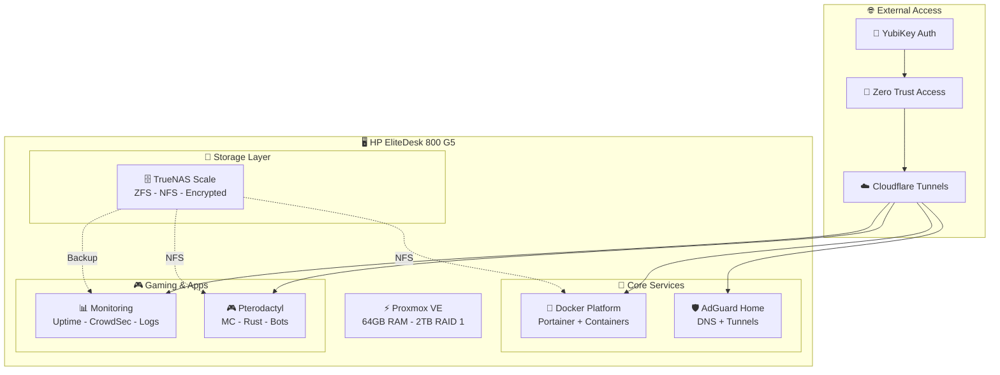

# 🏠 Personal Homelab Infrastructure

**Secure, practical home server environment built on Proxmox with enterprise-grade security practices**

---

## 🚀 Quick Overview

This repository contains the complete configuration and documentation for my personal homelab infrastructure. Built around security-first principles while maintaining practical single-admin management.

---

## 🏗️ Infrastructure Architecture



---

## 📁 Repository Structure

```
homelab-infrastructure/
├── 📖 README.md                # This file
├── ⚡ proxmox/
│   └── 📖 README.md            # Proxmox setup & hardening
├── 🗄️ truenas/
│   └── 📖 README.md            # TrueNAS + ZFS configuration
├── 🛡️ adguard-tunnels/
│   └── 📖 README.md            # DNS filtering + Cloudflare tunnels
├── 🐳 docker-platform/
│   └── 📖 README.md            # All containers (Plex, *arr, Paperless)
├── 🎮 gaming-platform/
│   └── 📖 README.md            # Pterodactyl + game servers
├── 📊 monitoring/
│   └── 📖 README.md            # Uptime Kuma + CrowdSec dashboard
└── 🔄 backup-guide.md          # Simple backup procedures
```

---

## 🎯 Service Endpoints

| Service         | Internal URL                  | External URL                  | Purpose               |
|-----------------|------------------------------|-------------------------------|-----------------------|
| ⚡ Proxmox      | `https://10.0.0.10:8006`      | `proxmox.tehzombijesus.ca`    | Hypervisor Management |
| 🗄️ TrueNAS      | `https://10.0.0.11`           | `storage.tehzombijesus.ca`    | Storage Management    |
| 🛡️ AdGuard      | `http://10.0.0.12:3000`       | `adguard.tehzombijesus.ca`    | DNS Filtering         |
| 🐳 Portainer    | `https://10.0.0.13:9000`      | `portainer.tehzombijesus.ca`  | Container Management  |
| 🎬 Plex         | `http://10.0.0.13:32400`      | `plex.tehzombijesus.ca`       | Media Server          |
| 🎮 Pterodactyl  | `https://10.0.0.14`           | `games.tehzombijesus.ca`      | Game Server Panel     |
| 📊 Monitoring   | `http://10.0.0.15:3001`       | `monitoring.tehzombijesus.ca` | System Monitoring     |

---

## 🔒 Security Features

- 🔑 **YubiKey 5 NFC** integration across all services
- 🛡️ **CrowdSec** threat intelligence on all VMs
- ☁️ **Cloudflare Zero Trust** for all external access
- 🔐 **SSH key-only** authentication (local network only)
- 🔒 **Encrypted storage** for sensitive data
- 📧 **Email alerting** for critical security events

---

## 🎯 Key Technologies

| Category      | Technology               | Purpose                  |
|---------------|-------------------------|--------------------------|
| **Hypervisor**| Proxmox VE              | VM management            |
| **Storage**   | TrueNAS Scale + ZFS     | Reliable data storage    |
| **Security**  | CrowdSec + YubiKey      | Threat protection        |
| **Containers**| Docker + Portainer      | Service deployment       |
| **Access**    | Cloudflare Tunnels      | Secure external access   |
| **Privacy**   | UsenetExpress           | Content acquisition      |

---

## 📋 Hardware Specifications

- **Server**: HP EliteDesk 800 G5
- **Memory**: 64GB RAM
- **Storage**: 2TB RAID 1 (expandable)
- **Network**: Single 10.0.0.x subnet
- **Authentication**: YubiKey 5 NFC

---

## 🚀 Quick Start

1. **Day 1**: Foundation setup (Proxmox → TrueNAS → Core Services)
2. **Day 2**: Applications deployment (Media → Gaming → Monitoring)
3. **Ongoing**: Maintenance and expansion  
   *Each VM directory contains its complete setup guide with commands and configurations.*

---

## 📚 Documentation

Each directory's README includes:

- 🛠️ **Installation steps** with copy-paste commands
- 🔒 **Security hardening** configurations
- 🔧 **Configuration files** and settings
- 🎯 **Testing procedures** to verify functionality

---

## 📞 Service Status

**Current Status**: 🔄 In Development  
**Target Completion**: [Your deployment dates]  
**License Usage**: Ubuntu Pro (4 of 5 licenses allocated)

---

## 🔮 Future Enhancements

- 📱 Mobile management apps
- 🏠 IoT device integration
- 🌍 Geographic redundancy (OVH offsite backups)
- 🤖 Advanced automation workflows

---

**⚠️ Security Notice:**  
All external access is secured through Cloudflare Zero Trust with YubiKey authentication. No direct port exposure to internet.

**💡 Philosophy:**  
Secure by design, practical to manage, privacy-focused infrastructure for personal use.
```
