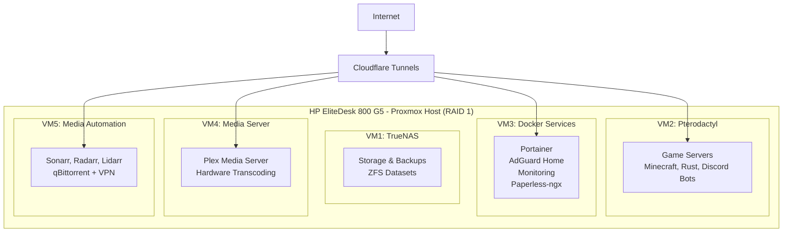

# Privacy-Focused Home Lab Setup

A comprehensive home lab with gaming servers, media automation, and document management capabilities, designed for networks with ISP port restrictions.

## What This Provides

**🎮 Gaming Infrastructure**
- Minecraft servers (Paper, Fabric, Forge, Modpacks)  
- Rust servers with automated wipe schedules
- Discord bots and game management via Pterodactyl
- and more services potentially

**📺 Media Ecosystem**
- Usenet only – all media‑automation traffic will go through a TLS‑secured Usenet provider.
- Complete Plex media server with hardware transcoding
- Automated downloading and organization (Sonarr, Radarr, Lidarr)
- Mobile access and international content support

**🔒 Privacy & Security**
- Network-wide ad blocking with AdGuard Home
- Zero Trust authentication via Cloudflare
- Canadian privacy-focused backup providers (not sure if OVH falls into that category)

**📊 Management & Monitoring**
- Web-based administration for all services
- Real-time monitoring and alerting
- Automated backup procedures
- Document management with OCR capabilities

## System Architecture

## Quick Start

### Prerequisites
- HP EliteDesk 800 G5 with 64GB RAM and RAID 1 storage
- Domain name registered (for Cloudflare tunnels)
- 5 free Ubuntu Pro licenses (available to all Ubuntu users)
- VPN provider subscription for secure downloads

### Installation Process
**[📖 Complete Installation Guide](docs/installation/README.md)**

The installation is broken into 4 phases:

1. **[Foundation](docs/installation/phase-1-foundation.md)** - Proxmox & TrueNAS storage (2-3 hours)
2. **[Docker Services](docs/installation/phase-2-docker-services.md)** - Container platform & core services (1-2 hours)  
3. **[Gaming & Media](docs/installation/phase-3-gaming-media.md)** - Entertainment infrastructure (2-4 hours)
4. **[Security & Monitoring](docs/installation/phase-4-security-monitoring.md)** - External access & monitoring (1-2 hours)

Each phase includes detailed rollback procedures and validation steps.

## Important Design Decisions

### ISP Port Restrictions
This setup is specifically designed for ISPs that block incoming ports (25, 53, 55, 77, 135, 139, 161, 162, 445, 1080, 4444). **Standard port forwarding will not work** - all external access uses Cloudflare tunnels.

### Web-First Administration
All management is performed through web interfaces - SSH access is not required for day-to-day operations. This makes the system accessible from mobile devices and simplifies remote administration.

### Privacy Focus
European providers are used for offsite backups, VPN protection covers all downloads, and services are isolated between VMs to prevent cross-contamination.

## System Specifications

| Component | Specification | Usage |
|-----------|---------------|--------|
| **Total RAM** | 64GB | 52GB allocated to VMs, 12GB for host |
| **Storage** | 2TB RAID 1 | ~1.4TB available for media storage |
| **VMs** | 5 Virtual Machines | Ubuntu Pro licensed |
| **Services** | 15+ Containerized | Docker managed via Portainer |

## Documentation Structure

### Installation
- **[Installation Overview](docs/installation/README.md)** - Complete setup guide
- **[Troubleshooting](docs/installation/troubleshooting.md)** - Common issues and solutions

### Reference
- **[Hardware Specifications](docs/reference/hardware.md)** - Detailed system requirements
- **[System Architecture](docs/reference/architecture.md)** - VM layout and service relationships
- **[VM Configurations](docs/reference/vm-configs.md)** - Resource allocation and settings
- **[Network & Security](docs/reference/networking.md)** - Cloudflare setup and security stack
- **[Service Access](docs/reference/services.md)** - Complete URL reference and descriptions

### Maintenance  
- **[Backup Strategy](docs/maintenance/backup.md)** - Local and offsite backup procedures
- **[Security Guidelines](docs/maintenance/security.md)** - Authentication and access control
- **[Monitoring Setup](docs/maintenance/monitoring.md)** - System health and alerting

## Service Categories

### Gaming Servers
| Service | Description | Access |
|---------|-------------|--------|
| Pterodactyl Panel | Game server management | games.tehzombijesus.ca |
| Minecraft Servers | Multiple server types and modpacks | Via game clients |
| Rust Server | Full server with automated wipes | Via game client |

### Media Services  
| Service | Description | Access |
|---------|-------------|--------|
| Plex Media Server | Movies, TV shows, music streaming | plex.tehzombijesus.ca |
| Sonarr | TV show automation | Internal network only |
| Radarr | Movie automation | Internal network only |
| Lidarr | Music automation | Internal network only |

### Core Services
| Service | Description | Access |
|---------|-------------|--------|
| Portainer | Container management | Internal network only |
| AdGuard Home | Network-wide ad blocking | Internal network only |
| Paperless-ngx | Document management with OCR | docs.tehzombijesus.ca |
| System Monitoring | Uptime and performance tracking | status.tehzombijesus.ca |

## Ready to Build?

**[🚀 Start Installation](docs/installation/README.md)**

The installation guide includes:
- Phase-by-phase approach for stable deployment
- Detailed rollback procedures for each step
- Resource usage validation and troubleshooting
- Complete configuration examples and templates

---

*This is a personal home lab setup guide. All service URLs and configurations are specific to my environment and should be adapted for your own domain and requirements.*
