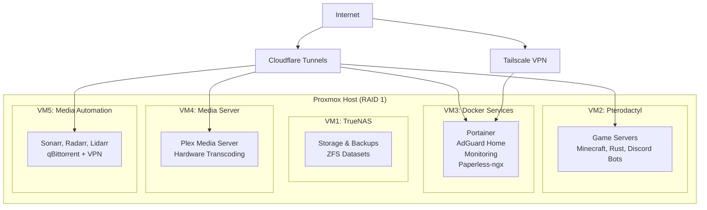

# 🏠 Home Lab Setup - tehzombijesus.ca

A comprehensive guide for building a privacy-focused home lab with gaming, media automation, and document management capabilities.

## 📋 Table of Contents

- [Overview](#overview)
- [Hardware Specifications](#hardware-specifications)
- [System Architecture](#system-architecture)
- [VM Configurations](#vm-configurations)
- [Network & Security](#network--security)
- [Backup Strategy](#backup-strategy)
- [Security & Privacy](#security--privacy)
- [Installation Guide](#installation-guide)
- [Service Access](#service-access)
- [Resource Allocation](#resource-allocation)
- [Contributing](#contributing)

## 🎯 Overview

This home lab setup is designed for:
- **Gaming servers** (Minecraft, Rust, Discord bots) with friends-only access
- **Media automation** and streaming (replacing Spotify with self-hosted solution)
- **Document management** with OCR capabilities
- **Network-wide ad blocking** and DNS management
- **Secure remote access** without exposing home IP
- **Privacy-focused** alternatives to big tech services

### User Profile
- **Location:** Gatineau, Quebec, Canada
- **Experience Level:** Command line comfortable, Docker newcomer
- **Privacy Focus:** Avoiding Google/Microsoft services and all non-privacy friendly.
- **ISP Port Restrictions:** 
  - **Incoming blocked:** 25, 53, 55, 77, 135, 139, 161, 162, 445, 1080, 4444
  - **Outgoing blocked:** 25, 139, 445, 4444
  - **Impact:** No direct port forwarding possible, Cloudflare tunnels required

## 🖥️ Hardware Specifications

| Component | Specification |
|-----------|---------------|
| **System** | HP EliteDesk 800 G5 |
| **CPU** | Intel Core i5 9500T |
| **RAM** | 64GB DDR4 |
| **Storage** | 2x 2TB NVMe drives (RAID 1) |
| **Domain** | tehzombijesus.ca |

### Storage Configuration
- **RAID 1 Setup:** 2TB mirrored for redundancy
- **VM Storage:** ~520GB for operating systems and applications
- **Media Storage:** ~1.4TB available for media libraries and backups

## 🏗️ System Architecture

## 🚀 VM Configurations

### VM1: TrueNAS Storage
- **OS:** TrueNAS SCALE
- **Resources:** 8GB RAM, 50GB disk
- **Purpose:** Primary storage with ZFS datasets
- **Datasets:**
  - Movies: ~600GB
  - TV Shows: ~500GB (K-drama, C-drama, Western)
  - Music: ~200GB
  - Backups: ~100GB
  - Downloads buffer

### VM2: Pterodactyl Gaming
- **OS:** Ubuntu Server 22.04 LTS + Pro
- **Resources:** 24-32GB RAM, 200GB disk
- **Services:**
  - Pterodactyl Panel + Wings
  - Minecraft servers
  - Rust servers
  - Discord bots
  - Cloudflare tunnel daemon
- **Installation:** Native (isolated from containers)

### VM3: Docker Services Hub
- **OS:** Ubuntu Server 22.04 LTS + Pro
- **Resources:** 12GB RAM, 100GB disk
- **Services:**
  - **Portainer** - Docker management interface
  - **AdGuard Home** - DNS/ad blocking with modern interface
  - **Uptime Kuma** - Service monitoring and alerts
  - **Homer/Heimdall** - Service dashboard
  - **Netdata** - Real-time system monitoring
  - **Paperless-ngx** - Document management with OCR

### VM4: Media Server
- **OS:** Ubuntu Server 22.04 LTS + Pro
- **Resources:** 8GB RAM, 100GB disk
- **Services:**
  - **Plex Media Server** (native install)
  - Hardware transcoding enabled
- **Storage:** Read-only mounts from TrueNAS datasets

### VM5: Media Automation
- **OS:** Ubuntu Server 22.04 LTS + Pro
- **Resources:** 8GB RAM, 150GB disk
- **Services (Docker containers):**
  - **Sonarr** - TV show automation
  - **Radarr** - Movie automation
  - **Lidarr** - Music automation
  - **Prowlarr** - Indexer management
  - **qBittorrent + VPN** - Protected downloads
    - Container: `binhex/arch-qbittorrentvpn`
    - Built-in kill switch
    - OpenVPN/Wireguard support

## 🌐 Network & Security

### Cloudflare Services (Free Tier)
- **DNS Management:** All subdomains
- **Tunnels:** Secure external access (uses outbound HTTPS port 443 - not blocked by ISP)
- **Zero Trust:** SSO and access policies
- **SSL Certificates:** Automatic generation
- **DDoS Protection:** Included
- **Port Bypass:** All services accessible through tunnels, avoiding ISP port restrictions

### Security Stack
- **Cloudflare Zero Trust:** Authentication and access control
- **Cloudflare Tunnels:** Bypass ISP port restrictions using outbound HTTPS (443)
- **Crowdsec:** Community-driven threat intelligence
- **Tailscale VPN:** Secure remote access (uses dynamic ports, typically works around ISP blocks)
- **VPN-protected Downloads:** All torrent traffic secured
- **Service Isolation:** VM separation for security
- **No Port Forwarding Required:** All external access via secure tunnels

## 📝 Service Access

| Service | URL | Purpose |
|---------|-----|---------|
| **Gaming** |
| Pterodactyl Panel | `games.tehzombijesus.ca` | Game server management |
| Minecraft Server | `minecraft.tehzombijesus.ca` | Direct game connection |
| Rust Server | `rust.tehzombijesus.ca` | Direct game connection |
| **Media** |
| Plex Server | `plex.tehzombijesus.ca` | Media streaming |
| Movies | `movies.tehzombijesus.ca` | Plex alternative access |
| Music | `music.tehzombijesus.ca` | Music-focused access |
| **Automation** |
| TV Shows | `sonarr.tehzombijesus.ca` | Sonarr interface |
| Movies | `radarr.tehzombijesus.ca` | Radarr interface |
| Music | `lidarr.tehzombijesus.ca` | Lidarr interface |
| **Management** |
| Network Admin | `admin.tehzombijesus.ca` | AdGuard Home |
| System Status | `status.tehzombijesus.ca` | Uptime monitoring |
| Documents | `docs.tehzombijesus.ca` | Paperless-ngx |

## 💾 Backup Strategy

### 🏠 Local Protection
- **RAID 1:** Instant drive failure protection
- **ZFS Snapshots:** Point-in-time recovery on datasets
- **Proxmox Backups:** VM snapshots using built-in tools

### ☁️ Offsite Backup
- **Provider:** Contabo Object Storage (German, privacy-focused)
- **Cost:** ~€3-10/month for essential data
- **Method:** rclone/restic with encryption
- **Schedule:** Weekly automated uploads
- **Content:** Game saves, configs, documents, personal files

## 🔒 Security & Privacy

### Core Principles
- **Zero Trust Architecture:** All external access through Cloudflare
- **Service Isolation:** Separate VMs for different functions
- **Encrypted Backups:** All offsite data encrypted
- **VPN Protection:** Torrent traffic secured
- **Privacy-First:** European providers, no big tech dependencies

### Authentication & Access
- **Cloudflare Zero Trust:** SSO for all services
- **2FA Enabled:** Multi-factor authentication
- **Geographic Restrictions:** Access policies by location
- **Device Management:** Tailscale for trusted devices

## 🛠️ Installation Guide

### Phase 1: Foundation
1. **Proxmox Installation**
   - Configure RAID 1 during installation
   - Set up networking and updates
   - Configure Ubuntu Pro licenses

2. **TrueNAS VM Setup**
   - Create ZFS datasets
   - Configure SMB/NFS shares
   - Set up snapshot schedules

### Phase 2: Container Platform
3. **Docker Services VM**
   - Install Docker and Docker Compose
   - Deploy Portainer
   - Configure container stack

### Phase 3: Core Services
4. **Gaming Infrastructure**
   - Install Pterodactyl Panel + Wings
   - Configure game server templates
   - Set up Cloudflare tunnels

5. **Media Stack**
   - Deploy Plex server
   - Configure hardware transcoding
   - Set up media automation containers

### Phase 4: Security & Monitoring
6. **Security Implementation**
   - Configure Cloudflare Zero Trust
   - Deploy Crowdsec protection
   - Set up Tailscale mesh VPN

7. **Backup Automation**
   - Configure local backup schedules
   - Set up Contabo offsite backups
   - Test recovery procedures

## 📊 Resource Allocation

| VM | RAM | Disk | CPU Priority |
|----|----|------|-------------|
| TrueNAS | 8GB | 50GB | Medium |
| Pterodactyl | 24-32GB | 200GB | High |
| Docker Services | 12GB | 100GB | Medium |
| Media Server | 8GB | 100GB | Medium |
| Media Automation | 8GB | 150GB | Low |
| **Total** | **60-68GB** | **600GB** | |
| **Available** | **64GB** | **2TB** | |

## 📚 Additional Resources

### Documentation
- [Proxmox VE Documentation](https://pve.proxmox.com/wiki/Main_Page)
- [TrueNAS SCALE Documentation](https://www.truenas.com/docs/scale/)
- [Pterodactyl Panel Documentation](https://pterodactyl.io/project/introduction.html)
- [Cloudflare Zero Trust Guide](https://developers.cloudflare.com/cloudflare-one/)

### Community Support
- [r/homelab](https://reddit.com/r/homelab) - General home lab community
- [r/selfhosted](https://reddit.com/r/selfhosted) - Self-hosting discussions
- [Pterodactyl Discord](https://discord.gg/pterodactyl) - Game server support

## 🤝 Contributing

This setup is designed for personal use but improvements and suggestions are welcome:

1. **Issues:** Report problems or suggest enhancements
2. **Documentation:** Help improve setup instructions
3. **Security:** Suggest security improvements
4. **Automation:** Share useful scripts or configurations

## 📄 License

This documentation is provided as-is for educational and personal use. Adapt and modify as needed for your own setup.

---

**⚠️ Important Notes:**
- This setup requires 5 Ubuntu Pro licenses (TrueNAS uses its own OS)
- VPN provider subscription needed for secure downloading
- Domain registration required for Cloudflare services
- **ISP Port Restrictions:** Setup designed around blocked ports (25,53,55,77,135,139,161,162,445,1080,4444 incoming; 25,139,445,4444 outgoing)
- **Cloudflare tunnels mandatory** for external access due to ISP restrictions
- Regular maintenance and updates recommended for security

**🎯 Next Steps:** Start with Proxmox installation and work through phases systematically. Each component builds on the previous ones for a stable, secure home lab environment.
