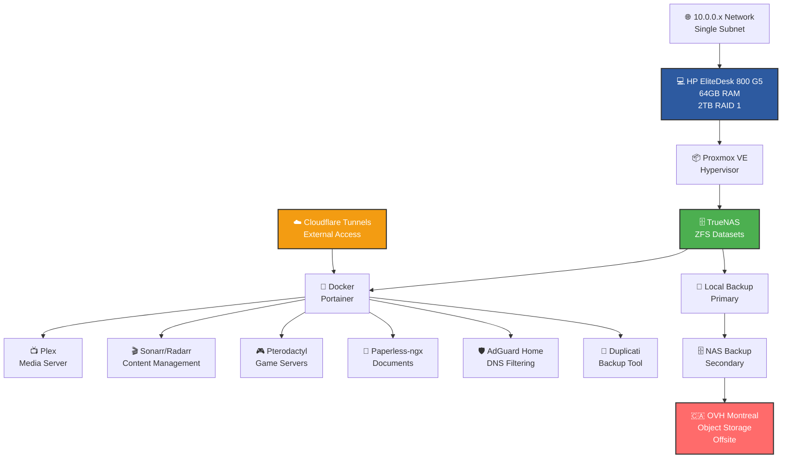

# 🏠 Homelab Infrastructure Setup

Complete infrastructure documentation for personal homelab deployment.

## 🖥️ Hardware & Core Infrastructure

### 💻 Physical Hardware
- **System**: HP EliteDesk 800 G5 💪
- **Memory**: 64GB RAM 🚀
- **Storage**: 2TB RAID 1 (local redundancy) 💾
- **Network**: 10.0.0.x subnet (single network, no VLANs) 🌐
- **Domain**: tehzombijesus.ca (owned) 🌍

### ⚡ Virtualization Stack
- **Hypervisor**: Proxmox VE (preferred platform) 📦
- **Storage**: TrueNAS with ZFS datasets 🗄️
- **Container Management**: Portainer (Docker orchestration for novice users) 🐳
- **OS Licensing**: Ubuntu Pro (5 free licenses available) 🐧

## 🛡️ Network & Security

### 🚫 ISP Port Restrictions
**Blocked Incoming**: 25, 53, 55, 77, 135, 139, 161, 162, 445, 1080, 4444  
**Blocked Outgoing**: 25, 139, 445, 4444

### 🔐 Access & Security Model
- **External Access**: Cloudflare tunnels only (maximize free tier services) ☁️
- **SSH**: Local network access only, never external 🚪
- **Authentication**: YubiKey 5 NFC integration wherever supported 🔑
- **Security Philosophy**: Secure but practical for personal use (avoid enterprise overkill) ⚖️
- **Administration**: Web-based interfaces preferred over CLI 🌐

## 💾 Backup Strategy (3-2-1 Rule)

### 🏗️ Infrastructure Overview
```
┌─────────────────────────────────────────────────────────────────┐
│                    🏠 HOMELAB INFRASTRUCTURE                    │
├─────────────────────────────────────────────────────────────────┤
│                                                                 │
│  ┌─────────────────┐    ┌──────────────────┐    ┌─────────────┐ │
│  │  💻 HP EliteDesk │    │   🌐 Network     │    │ ☁️ External │ │
│  │     800 G5      │    │   10.0.0.x       │    │   Access    │ │
│  │   64GB RAM      │────│   Single Net     │────│ Cloudflare  │ │
│  │   2TB RAID 1    │    │   No VLANs       │    │  Tunnels    │ │
│  └─────────────────┘    └──────────────────┘    └─────────────┘ │
│           │                                                     │
│           ▼                                                     │
│  ┌─────────────────┐    ┌──────────────────┐    ┌─────────────┐ │
│  │  📦 Proxmox VE  │    │  🗄️ TrueNAS      │    │ 🐳 Docker   │ │
│  │  Hypervisor     │────│  ZFS Datasets    │────│  Portainer  │ │
│  │  Ubuntu Pro     │    │  Primary Storage │    │  Containers │ │
│  └─────────────────┘    └──────────────────┘    └─────────────┘ │
│                                   │                             │
│                                   ▼                             │
│                          ┌─────────────────┐                   │
│                          │   🚀 Services   │                   │
│                          │                 │                   │
│                          │ 📺 Plex         │                   │
│                          │ 🎬 Sonarr/Radarr│                   │
│                          │ 🎮 Pterodactyl  │                   │
│                          │ 📄 Paperless    │                   │
│                          │ 🛡️ AdGuard      │                   │
│                          └─────────────────┘                   │
└─────────────────────────────────────────────────────────────────┘
```

### 🔄 Backup Architecture


**3-2-1 Backup Flow:**
```
💾 Local RAID 1 → 🗄️ TrueNAS (ZFS) → 🇨🇦 OVH Montreal Object Storage
     ↑                 ↑                          ↑
  Primary          Secondary                   Offsite
```

### 🛠️ Backup Implementation
- **Tool**: Duplicati (web-based interface, Docker deployment) 🌐
- **Encryption**: AES-256 built-in encryption 🔒
- **Destination**: OVH Standard Object Storage - Montreal 🇨🇦
- **Cost**: ~$0.022/GB/month (estimated $1-5/month for critical data) 💰
- **Scope**: Configs, databases, documents, application data 📋
- **Exclusions**: Media files (re-downloadable), OS images (rebuildable) ❌

### ✅ Backup Selection Criteria
- **Critical Data**: Configuration files, databases, Paperless documents 📄
- **Application Data**: Docker compose files, game saves (if irreplaceable) 🎮
- **Skip**: Media libraries, system images, easily replaceable data ⏭️

## 🚀 Core Services

### ⚙️ Infrastructure Services
- **DNS**: AdGuard Home (network-wide ad blocking) 🛡️
- **Monitoring**: Simple service uptime and resource monitoring 📊
- **Alerts**: Email notifications for critical alerts only 📧
- **Updates**: Automated where safe, manual for major changes 🔄

### 🎬 Media & Entertainment
- **Media Server**: Plex 📺
- **Content Management**: Sonarr, Radarr, Lidarr (Usenet automation) 🎭
- **Downloads**: Swiss Usenet providers (UsenetExpress for privacy) 🇨🇭
- **Gaming**: Pterodactyl panel for Minecraft/Rust servers, Discord bots 🎮

### 📋 Productivity & Management
- **Document Management**: Paperless-ngx 📄
- **Container Orchestration**: Portainer (web-based Docker management) 🐳

## 🌐 Service Access & Deployment

### 🚀 External Access Strategy
- **Method**: Cloudflare tunnels exclusively ☁️
- **Benefits**: No exposed ports, free tier utilization, built-in security 🛡️
- **Services**: Web interfaces accessible remotely via secure tunnels 🔒

### 🐳 Container Management
- **Platform**: Docker with Portainer web UI 📦
- **Skill Level**: Designed for novice Docker users 👶
- **Deployment**: Web-based container management and monitoring 🌐

## 🔧 Maintenance & Operations

### 🔄 Update Strategy
- **Automated**: Security updates and minor versions where safe ✅
- **Manual**: Major version upgrades and significant changes ✋
- **Testing**: Non-production testing preferred for critical services 🧪

### 📊 Monitoring Philosophy
- **Scope**: Service availability and basic resource monitoring 📈
- **Alerting**: Email notifications for critical issues only 📧
- **Simplicity**: Avoid over-monitoring and alert fatigue 🎯

## 💳 Payment & Privacy Considerations

### 🔐 Privacy-Focused Providers
- **Backup**: OVH Montreal (Canadian data sovereignty) 🇨🇦
- **Downloads**: Swiss Usenet providers (UsenetExpress) 🇨🇭
- **Payment**: Proton Wallet/Bitcoin for privacy-focused services ₿

### 🌍 Geographic Preferences
- **Backup Storage**: Montreal, Canada (local data residency) 🏔️
- **Network**: Canadian routing when possible 🍁
- **Compliance**: Canadian data protection alignment ⚖️

## 🌐 Network Architecture

### 🏗️ Simple Network Design
- **Topology**: Single 10.0.0.x network 🕸️
- **Complexity**: No VLANs or special routing hardware ⚡
- **Management**: Standard home networking approach 🏠
- **Access**: Cloudflare tunnels for external connectivity ☁️

## 📚 Documentation Standards

### 📊 Visual Documentation
- **Diagrams**: Black/monochrome only ⚫
- **Compatibility**: GitHub dark theme optimized 🌙
- **Simplicity**: Clear, functional documentation over visual flair ✨
