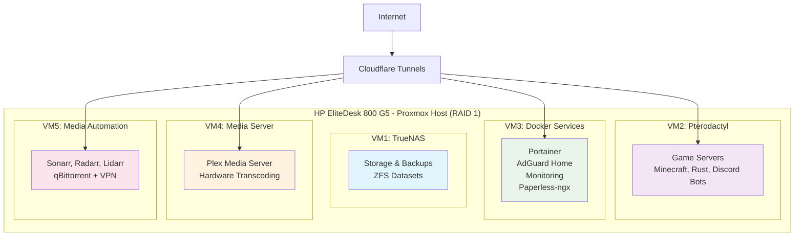

# 🏠 Home Lab Setup - tehzombijesus.ca

A comprehensive privacy-focused home lab with gaming servers, media automation, and document management capabilities.

## 🎯 Overview

This home lab setup provides:
- **Gaming servers** (Minecraft, Rust, Discord bots) for friends-only access
- **Media automation** and streaming (self-hosted Spotify replacement)
- **Document management** with OCR capabilities
- **Network-wide ad blocking** and DNS management
- **Secure remote access** without exposing home IP
- **Privacy-focused** alternatives to big tech services

All services are accessible through Cloudflare tunnels, bypassing ISP port restrictions and providing enterprise-grade security.

## 🏗️ System Architecture



## 📚 Documentation Structure

### Core Documentation
- **[Hardware Specifications](docs/hardware.md)** - Detailed system specs and storage configuration
- **[System Architecture](docs/architecture.md)** - Complete VM layout and service relationships
- **[VM Configurations](docs/vm-configs.md)** - Individual VM setup and resource allocation
- **[Network & Security](docs/networking.md)** - Cloudflare setup, DNS, and security stack
- **[Installation Guide](docs/installation.md)** - Step-by-step implementation phases

### Service Documentation
- **[Service Access](docs/services.md)** - Complete URL reference and service descriptions
- **[Backup Strategy](docs/backup.md)** - Local and offsite backup configurations
- **[Security & Privacy](docs/security.md)** - Authentication, access control, and privacy measures

## ⚡ Quick Start

1. **Prerequisites Check**
   - HP EliteDesk 800 G5 with upgraded specs
   - 5 Ubuntu Pro licenses available
   - Domain name registered (tehzombijesus.ca)
   - VPN provider subscription for secure downloads

2. **Installation Order**
   ```bash
   Phase 1: Proxmox + TrueNAS (Storage Foundation)
   Phase 2: Docker Services VM (Container Platform)
   Phase 3: Gaming + Media VMs (Core Services)  
   Phase 4: Security + Monitoring (Protection Layer)
   ```

3. **First Access**
   - Configure Cloudflare DNS and tunnels
   - Set up Zero Trust authentication
   - Deploy core containers via Portainer

## 🔗 Service Quick Links

Once deployed, access your services at:

| Category | Service | URL |
|----------|---------|-----|
| **Gaming** | Pterodactyl Panel | `games.tehzombijesus.ca` |
| **Media** | Plex Server | `plex.tehzombijesus.ca` |
| **Management** | Service Dashboard | `status.tehzombijesus.ca` |
| **Documents** | Paperless-ngx | `docs.tehzombijesus.ca` |

*See [Service Access Documentation](docs/services.md) for complete URL list*

## 📊 Resource Summary

| Component | Specification | Usage |
|-----------|---------------|-------|
| **Total RAM** | 64GB | 60-68GB allocated |
| **Storage** | 2TB RAID 1 | ~1.4TB for media |
| **VMs** | 5 Virtual Machines | Ubuntu Pro licensed |
| **Services** | 15+ Containerized | Docker managed |

## 🚨 Important Notes

- **ISP Port Restrictions:** Incoming ports blocked: `25,53,55,77,135,139,161,162,445,1080,4444`
- **Cloudflare Tunnels Required:** No port forwarding possible due to ISP limitations
- **Privacy Focus:** European providers used for offsite storage
- **Container Management:** All services deployed via Portainer web interface
- **Zero Maintenance SSH:** All admin tasks through web interfaces

## 🎮 Supported Game Servers

- **Minecraft** - Paper, Fabric, Forge, Modpacks
- **Rust** - Full server with wipe schedules  
- **Discord Bots** - Node.js and Python support
- **Expandable** - Easy addition of new game types via Pterodactyl

## 🎬 Media Capabilities

- **Movies & TV Shows** - Automated download and organization
- **Music Library** - Complete Spotify replacement with Plexamp
- **International Content** - K-drama and C-drama support
- **Quality Control** - Automated upgrading and management
- **Mobile Access** - Full Plex mobile app support

## 🛡️ Security Features

- **Zero Trust Architecture** - Cloudflare authentication for all services
- **VPN Protection** - All downloads through encrypted tunnels
- **Service Isolation** - VM separation prevents cross-contamination
- **Encrypted Backups** - Offsite storage with client-side encryption
- **Network Security** - AdGuard Home blocks threats network-wide

## 📈 Monitoring & Alerts

- **Uptime Monitoring** - Real-time service availability tracking
- **System Metrics** - CPU, RAM, storage, and network monitoring
- **Service Health** - Container status and resource usage
- **Automated Alerts** - Notification when services go offline

---

**Ready to build?** Start with the [Installation Guide](docs/installation.md) and follow the phase-by-phase approach for a stable, secure deployment.

**Need help?** Each documentation section includes troubleshooting tips and common solutions for a smooth setup experience.
