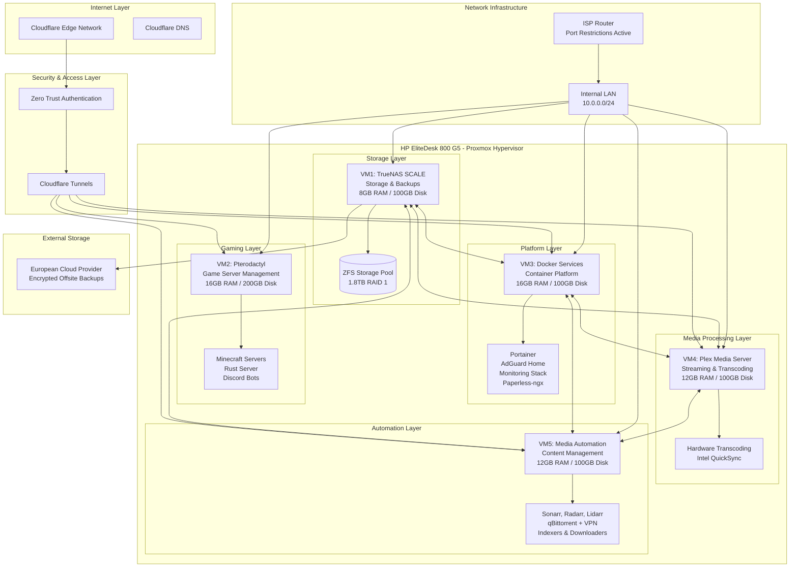
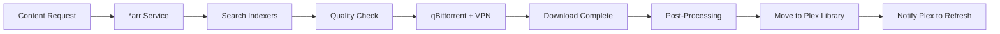
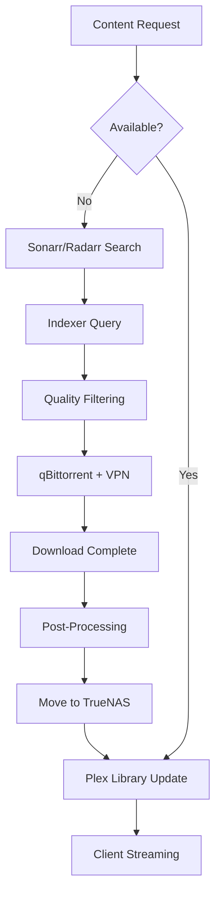
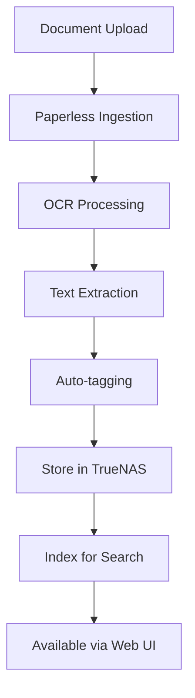
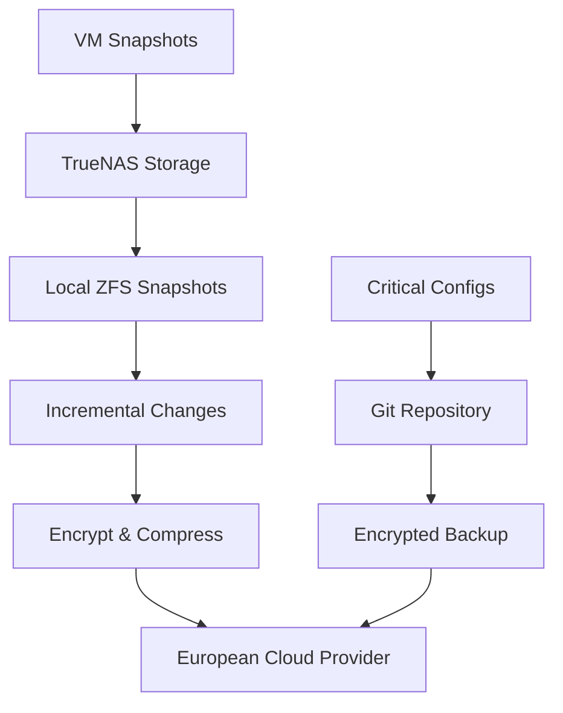

# System Architecture - tehzombijesus.ca Home Lab

## 📐 Architecture Overview

The home lab follows a **multi-tier virtualized architecture** with clear separation of concerns, ensuring security, performance, and maintainability. Each VM serves a specific purpose while maintaining interconnectivity through secure internal networks.



## 🏛️ Architectural Principles

### 1. **Layered Security Architecture**
- **Perimeter Defense**: Cloudflare Zero Trust prevents unauthorized access
- **Network Segmentation**: VM isolation prevents lateral movement
- **Service Isolation**: Containerized applications with resource limits
- **Data Protection**: Encrypted storage and secure backup pipelines

### 2. **High Availability Design**
- **RAID 1 Storage**: Hardware-level redundancy for critical data
- **Service Redundancy**: Multiple paths to critical services
- **Automated Failover**: Container restart policies and health checks
- **Backup Strategy**: Multiple backup tiers with offsite replication

### 3. **Scalability Framework**
- **Horizontal Scaling**: Easy addition of new VMs and containers
- **Resource Elasticity**: Dynamic resource allocation via Proxmox
- **Service Expansion**: Modular architecture supports new services
- **Performance Optimization**: Dedicated VMs for resource-intensive tasks

## 🔧 Component Details

### **Hypervisor Layer: Proxmox VE**

```
Host System: HP EliteDesk 800 G5
├── CPU: Intel i5-9500T (6 cores, 12 threads)
├── RAM: 64GB DDR4
├── Storage: 2TB NVMe RAID 1 (software)
├── Network: Gigabit Ethernet
└── Management: Proxmox Web Interface (8006)
```

**Key Features:**
- VM resource management and allocation
- Snapshot and backup capabilities  
- Live migration support (for future expansion)
- Web-based administration interface
- Integration with storage backends

---

### **VM1: TrueNAS SCALE (Storage Foundation)**

```
Purpose: Centralized storage and backup management
Resources: 8GB RAM, 100GB OS disk
Storage Backend: ZFS with 1.8TB capacity

Services:
├── ZFS Storage Pool Management
├── SMB/NFS shares for VM access
├── Snapshot scheduling
├── Cloud backup sync
└── S.M.A.R.T. monitoring
```

**Storage Architecture:**
```
ZFS Pool Layout:
├── Media Dataset (1.4TB)
│   ├── Movies
│   ├── TV Shows  
│   ├── Music
│   └── Books
├── Documents Dataset (200GB)
│   ├── Paperless ingestion
│   └── Archive storage
├── Backups Dataset (200GB)
│   ├── VM snapshots
│   └── Configuration exports
└── System Dataset (remaining)
```

**Network Interfaces:**
- Internal VM network: 10.0.0.10
- Management interface: Web GUI on port 80/443
- Storage protocols: SMB (445), NFS (2049)

---

### **VM2: Pterodactyl (Gaming Management)**

```
Purpose: Game server hosting and management
Resources: 16GB RAM, 200GB disk
Container Runtime: Docker with Pterodactyl Panel

Game Servers:
├── Minecraft Paper Server (4GB allocated)
├── Minecraft Modded Server (6GB allocated)  
├── Rust Server (4GB allocated)
└── Discord Bots (Node.js runtime)
```

**Service Architecture:**
```
Pterodactyl Stack:
├── Panel (Web Interface)
│   └── User management
│   └── Server allocation
│   └── File management
├── Wings (Node Daemon)  
│   └── Container management
│   └── Resource monitoring
│   └── Log aggregation
└── Database (MariaDB)
    └── Server configurations
    └── User sessions
    └── Audit logs
```

**External Access:**
- Web Panel: `games.tehzombijesus.ca`
- Game Servers: Direct IP with custom ports
- SFTP Access: File management for server owners

---

### **VM3: Docker Services (Platform Foundation)**

```
Purpose: Container platform and core services
Resources: 16GB RAM, 100GB disk
Container Orchestration: Docker + Portainer

Core Services Stack:
├── Portainer (Container Management)
├── AdGuard Home (DNS & Ad Blocking)
├── Paperless-ngx (Document Management)
├── Uptime Kuma (Service Monitoring)
├── Grafana (Metrics Dashboard)
└── Prometheus (Metrics Collection)
```

**Service Details:**

**Portainer:**
- Container lifecycle management
- Image registry integration  
- Stack deployment via compose files
- Resource usage monitoring
- User access control

**AdGuard Home:**
- Network-wide ad and tracker blocking
- Custom DNS filtering rules
- Upstream DNS configuration (Cloudflare)
- Query logging and analytics
- Parental controls and safe browsing

**Paperless-ngx:**
- Document ingestion via watched folders
- OCR processing for searchable text
- Automatic tagging and categorization
- Full-text search capabilities
- REST API for document management

**Monitoring Stack:**
- **Uptime Kuma**: Service availability monitoring with beautiful dashboard
- **Prometheus**: Metrics collection from all VMs and services
- **Grafana**: Visualization and alerting for system metrics
- **Node Exporter**: System metrics from each VM

---

### **VM4: Plex Media Server (Streaming Hub)**

```
Purpose: Media streaming and transcoding
Resources: 12GB RAM, 100GB disk
Hardware Acceleration: Intel QuickSync

Media Processing:
├── Direct Play (optimal quality)
├── Direct Stream (container conversion)
├── Hardware Transcoding (quality adaptation)
└── Multi-user streaming support
```

**Hardware Transcoding Setup:**
```
Intel QuickSync Configuration:
├── H.264 encoding/decoding
├── H.265 (HEVC) support
├── Multiple simultaneous streams
└── 4K transcoding capability
```

**Media Library Structure:**
```
Plex Libraries:
├── Movies (1080p/4K)
├── TV Shows (multi-season)
├── Music (FLAC/MP3)
├── Audiobooks 
└── Home Videos
```

**Client Support:**
- Web browser access via `plex.tehzombijesus.ca`
- Mobile apps (iOS/Android) with offline sync
- Smart TV apps and streaming devices
- Desktop applications for all platforms

---

### **VM5: Media Automation (Content Pipeline)**

```
Purpose: Automated media acquisition and management
Resources: 12GB RAM, 100GB disk
VPN Integration: All downloads through encrypted tunnel

Automation Services:
├── Sonarr (TV Show management)
├── Radarr (Movie management)  
├── Lidarr (Music management)
├── Prowlarr (Indexer management)
└── qBittorrent (Download client)
```

**Content Workflow:**


**Quality Profiles:**
- **Movies**: 1080p Web-DL preferred, 4K for selected titles
- **TV Shows**: 1080p x264/x265, automatic episode monitoring
- **Music**: FLAC preferred, MP3 320kbps fallback
- **Anime**: Specialized trackers with subtitle preference

**VPN Configuration:**
- All download traffic routed through VPN tunnel
- Kill switch prevents unencrypted connections
- Geographic IP rotation for tracker access
- No-logs provider with European jurisdiction

---

## 🌐 Network Architecture

### **Internal Networking**

```
Network Topology:
├── Proxmox Bridge (vmbr0): 10.0.0.1/24
├── VM1 (TrueNAS): 10.0.0.10/24
├── VM2 (Pterodactyl): 10.0.0.20/24  
├── VM3 (Docker Services): 10.0.0.30/24
├── VM4 (Plex): 10.0.0.40/24
└── VM5 (Media Automation): 10.0.0.50/24
```

**Inter-VM Communication:**
- Storage access: SMB/NFS from TrueNAS to other VMs
- Service discovery: Internal DNS resolution
- Monitoring: Prometheus scraping all VM endpoints
- Backup coordination: Automated backup triggers

### **External Access via Cloudflare**

```
Cloudflare Tunnel Architecture:
├── Tunnel Daemon (VM3): Establishes secure outbound connections
├── DNS Records: CNAME records pointing to tunnel endpoints
├── Access Policies: Zero Trust authentication rules
└── Load Balancing: Automatic failover and geographic routing
```

**Exposed Services:**
| Service | Internal | External URL | Authentication |
|---------|----------|--------------|---------------|
| Portainer | 10.0.0.30:9000 | `docker.tehzombijesus.ca` | Zero Trust |
| Plex | 10.0.0.40:32400 | `plex.tehzombijesus.ca` | Plex + Zero Trust |
| Pterodactyl | 10.0.0.20:80 | `games.tehzombijesus.ca` | Panel + Zero Trust |
| Paperless | 10.0.0.30:8000 | `docs.tehzombijesus.ca` | Zero Trust |
| Monitoring | 10.0.0.30:3001 | `status.tehzombijesus.ca` | Zero Trust |

### **DNS and Security**

**AdGuard Home Configuration:**
- Primary DNS: 1.1.1.1, 1.0.0.1 (Cloudflare)
- Secondary DNS: 8.8.8.8, 8.8.4.4 (Google)
- Blocklists: Steven Black, EasyList, Malware domains
- Custom rules: Local domain resolution, whitelist exceptions

**Zero Trust Policies:**
- Email-based authentication for all services
- Geographic restrictions where applicable  
- Session timeout and re-authentication
- Device enrollment for mobile access

---

## 🔄 Data Flow Architecture

### **Media Content Pipeline**



### **Document Processing Workflow**



### **Backup Data Flow**



---

## 🚀 Performance Optimizations

### **Resource Allocation Strategy**

**Memory Distribution:**
- Proxmox Host: 2GB reserved
- TrueNAS: 8GB (ZFS requires significant RAM)
- Pterodactyl: 16GB (game servers are memory-intensive)
- Docker Services: 16GB (multiple containers)
- Plex: 12GB (transcoding buffer)
- Media Automation: 12GB (parallel processing)

**CPU Affinity:**
- Game servers: Dedicated CPU cores for consistent performance
- Plex transcoding: Hardware acceleration reduces CPU load
- Background services: Shared CPU resources with limits

**Storage Performance:**
- VM OS disks: Fast NVMe storage for responsiveness
- Media files: Optimized for sequential read performance
- Database storage: SSD tier for transaction-heavy workloads

### **Network Optimization**

**Bandwidth Management:**
- Download prioritization: Off-peak hours for large content
- Transcoding optimization: Local network gets full quality
- VPN traffic: Optimized routing for download services
- Backup scheduling: Overnight sync to minimize impact

---

## 🛡️ Security Architecture

### **Defense in Depth Strategy**

**Layer 1 - Perimeter (Cloudflare)**
- DDoS protection and rate limiting
- WAF rules for common attacks
- Geographic blocking for suspicious regions
- Certificate management and SSL/TLS termination

**Layer 2 - Access Control (Zero Trust)**
- Identity verification for all service access
- Multi-factor authentication requirements
- Session management and timeout controls
- Device compliance checking

**Layer 3 - Network (VM Isolation)**
- Virtualized network segments
- Firewall rules between VMs
- Service-specific port restrictions
- Internal traffic monitoring

**Layer 4 - Application (Container Security)**
- Non-root container execution
- Resource limits and quotas
- Regular image updates and vulnerability scanning
- Secrets management for sensitive data

**Layer 5 - Data (Encryption & Backup)**
- Encryption at rest for sensitive data
- Encrypted backup transmission
- Access logging and audit trails
- Regular backup testing and restoration

---

## 📊 Monitoring and Observability

### **Multi-Layer Monitoring Stack**

**Infrastructure Level:**
- Proxmox: Host resource utilization, VM status
- TrueNAS: Storage health, disk status, pool utilization
- Network: Bandwidth usage, connection monitoring

**Application Level:**
- Container metrics: CPU, memory, disk I/O per service
- Service availability: Health checks and uptime monitoring
- Performance metrics: Response times, throughput

**Business Level:**
- Content library growth: New additions, storage trends
- User activity: Streaming patterns, popular content
- System efficiency: Resource utilization optimization

### **Alerting Strategy**

**Critical Alerts (Immediate Action Required):**
- VM or service failures
- Storage capacity warnings (>85%)
- Network connectivity loss
- Security breach indicators

**Warning Alerts (Next Day Action):**
- Resource utilization trends
- Backup job failures
- Performance degradation
- Certificate expiration warnings

**Informational (Weekly Review):**
- System performance reports
- Storage utilization trends  
- Content library statistics
- Security event summaries

---

## 🔮 Future Expansion Capabilities

### **Horizontal Scaling Options**

**Additional VMs:**
- Home automation hub (Home Assistant)
- Development environment (GitLab, CI/CD)
- Security camera NVR system
- Additional game server nodes

**Service Expansion:**
- Additional *arr services for specialized content
- Enhanced monitoring with custom dashboards
- Backup service redundancy
- Container registry for custom applications

### **Hardware Upgrade Path**

**Memory Expansion:**
- Current: 64GB DDR4
- Maximum: 128GB DDR4
- Benefit: More concurrent services, larger caches

**Storage Scaling:**
- Additional drives for expanded RAID arrays
- NAS device integration for cold storage
- SSD tiers for database and cache optimization

**Network Enhancement:**
- 10Gb network upgrade for high-bandwidth services
- Dedicated backup network segment
- Multiple internet connections for failover

---

This architecture provides a robust, secure, and scalable foundation for the tehzombijesus.ca home lab, with clear separation of concerns and room for future growth.
