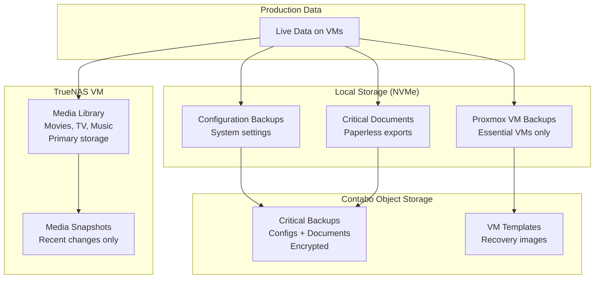
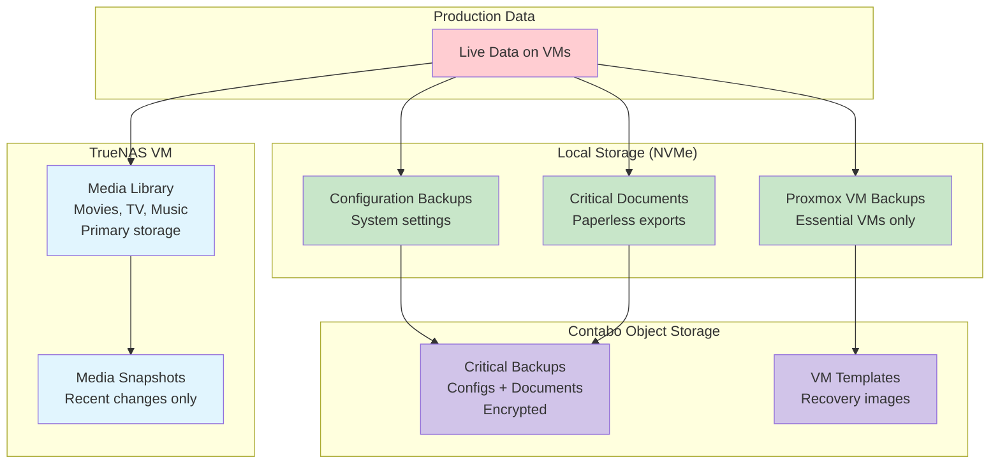

# Backup Strategy - tehzombijesus.ca Home Lab

## 🛡️ Backup Philosophy

This home lab implements a **practical two-tier backup strategy** using local storage efficiently and Contabo Object Storage for critical data protection. TrueNAS is primarily dedicated to media storage, with essential backups stored locally on NVMe and critical data synced to cloud.

## 📐 Backup Architecture Overview

### **Efficient 3-2-1 Rule Implementation**

```
Practical 3-2-1 Rule:
├── 3 Copies: Original + Local snapshots/backups + Contabo cloud
├── 2 Different Media: Local NVMe + Contabo Object Storage (S3)
└── 1 Offsite: Contabo Object Storage with encryption
```



---

## 🏠 Local Storage Strategy

### **NVMe Storage Allocation (1TB usable)**

```
NVMe Storage Distribution:
├── Proxmox Host: 200GB
│   ├── Proxmox OS: 32GB
│   ├── VM Backups: 100GB (critical VMs only)
│   ├── ISO Storage: 30GB
│   └── Snapshots: 38GB
├── VM Operating Systems: 500GB
│   ├── TrueNAS: 100GB (OS + minimal data)
│   ├── Pterodactyl: 150GB (game worlds + backups)
│   ├── Docker Services: 100GB (containers + volumes)
│   ├── Plex: 100GB (metadata + thumbnails)
│   └── Media Automation: 50GB (temp processing)
├── Local Backups: 200GB
│   ├── Configuration exports: 50GB
│   ├── Document backups: 50GB
│   ├── Critical data staging: 100GB
└── Available: 100GB (expansion buffer)
```

### **Local Backup Strategy**

**Critical VM Backups (Local NVMe):**
```yaml
Backup Targets: Docker Services VM, TrueNAS VM only
Frequency: Daily at 2:00 AM
Retention: 
  - 7 daily backups (1 week)
  - 4 weekly backups (1 month total)
Storage: /var/lib/vz/dump/ (Proxmox local)
Size: ~15GB per backup set
```

**Configuration Backup System:**
```bash
#!/bin/bash
# /opt/scripts/config-backup.sh

BACKUP_DIR="/opt/backups/configs"
DATE=$(date +%Y%m%d)

# Create daily config backup
mkdir -p "$BACKUP_DIR/$DATE"

# Proxmox configuration
cp -r /etc/pve "$BACKUP_DIR/$DATE/proxmox-config"

# Export VM configurations
for vm in $(qm list | awk '{if(NR>1) print $1}'); do
    qm config $vm > "$BACKUP_DIR/$DATE/vm-$vm.conf"
done

# Container configurations (from Docker Services VM)
ssh docker-vm "docker inspect \$(docker ps -aq)" > "$BACKUP_DIR/$DATE/container-configs.json"

# Network configurations
cp /etc/network/interfaces "$BACKUP_DIR/$DATE/"
cp /etc/hosts "$BACKUP_DIR/$DATE/"

# Create compressed archive
tar -czf "$BACKUP_DIR/config-backup-$DATE.tar.gz" -C "$BACKUP_DIR" "$DATE"
rm -rf "$BACKUP_DIR/$DATE"

# Keep only last 14 days locally
find "$BACKUP_DIR" -name "config-backup-*.tar.gz" -mtime +14 -delete
```

---

## 🗄️ TrueNAS Storage Strategy

### **TrueNAS Dataset Organization**

```
TrueNAS Pool Layout (1.8TB):
├── Media Dataset: 1.4TB (primary purpose)
│   ├── Movies: ~800GB
│   ├── TV Shows: ~400GB
│   ├── Music: ~100GB
│   └── Books/Audiobooks: ~100GB
├── Documents: 200GB (Paperless-ngx)
│   ├── Processed documents
│   └── OCR cache
├── Backups: 100GB (staging for cloud upload)
│   ├── Config exports from other VMs
│   └── Critical document exports
└── System: 100GB (TrueNAS OS and logs)
```

**Media-Focused Snapshot Policy:**
```yaml
Media Dataset Snapshots:
  hourly: 6 snapshots (6 hours - for active downloads)
  daily: 3 snapshots (3 days - recent additions)
  weekly: 2 snapshots (2 weeks - major library changes)
  
Documents Dataset Snapshots:
  every_15min: 4 (1 hour - active document processing)
  hourly: 24 (1 day - document changes)
  daily: 7 (1 week - document history)
  weekly: 4 (1 month - long-term document retention)
  
Note: Media content can be re-acquired, so minimal snapshot retention
      Documents need more protection due to uniqueness
```

**TrueNAS Backup Preparation:**
```bash
#!/bin/bash
# /opt/scripts/truenas-backup-prep.sh

STAGING_DIR="/mnt/pool/backups/staging"
DATE=$(date +%Y%m%d)

# Export TrueNAS configuration
cli -c 'system config export' > "$STAGING_DIR/truenas-config-$DATE.db"

# Export critical document metadata (not full files)
sqlite3 /mnt/pool/documents/paperless.db ".dump" > "$STAGING_DIR/paperless-metadata-$DATE.sql"

# Create document index (for recovery reference)
find /mnt/pool/documents -type f -name "*.pdf" | \
    xargs -I {} sh -c 'echo "$(sha256sum "{}")" >> '"$STAGING_DIR/document-inventory-$DATE.txt"'

# Compress staging directory
tar -czf "$STAGING_DIR/../backup-staging-$DATE.tar.gz" -C "$STAGING_DIR" .
rm -rf "$STAGING_DIR/*"
```

---

## ☁️ Contabo Object Storage Strategy

### **Contabo S3 Configuration**

**Storage Account Setup:**
```
Provider: Contabo Object Storage
Region: EU (Germany - GDPR compliant)
Initial Allocation: 250GB
Scaling: Automatic expansion as needed
API: S3-compatible interface
Encryption: Client-side before upload
```

**S3 Client Configuration (rclone):**
```ini
# /root/.config/rclone/rclone.conf
[contabo-s3]
type = s3
provider = Other
access_key_id = [YOUR_ACCESS_KEY]
secret_access_key = [YOUR_SECRET_KEY]  
endpoint = https://eu2.contabostorage.com
region = eu-central-1
location_constraint = eu-central-1

# Upload optimization
upload_concurrency = 4
chunk_size = 64M
disable_checksum = false
```

### **Cloud Backup Implementation**

**Critical Data Backup Script:**
```bash
#!/bin/bash
# /opt/scripts/contabo-backup.sh

S3_BUCKET="homelab-backups"
DATE=$(date +%Y%m%d)
STAGING_DIR="/tmp/cloud-backup"
LOG_FILE="/var/log/contabo-backup.log"

echo "$(date): Starting Contabo backup" >> $LOG_FILE

mkdir -p $STAGING_DIR

# 1. System configurations (daily)
echo "Backing up configurations..." >> $LOG_FILE
tar -czf "$STAGING_DIR/configs-$DATE.tar.gz" /opt/backups/configs/
gpg --cipher-algo AES256 --compress-algo 1 --symmetric \
    --output "$STAGING_DIR/configs-$DATE.tar.gz.gpg" \
    "$STAGING_DIR/configs-$DATE.tar.gz"
rm "$STAGING_DIR/configs-$DATE.tar.gz"

# 2. Critical documents (daily)
echo "Backing up documents..." >> $LOG_FILE  
tar -czf "$STAGING_DIR/documents-$DATE.tar.gz" /mnt/pool/backups/staging/
gpg --cipher-algo AES256 --compress-algo 1 --symmetric \
    --output "$STAGING_DIR/documents-$DATE.tar.gz.gpg" \
    "$STAGING_DIR/documents-$DATE.tar.gz"  
rm "$STAGING_DIR/documents-$DATE.tar.gz"

# 3. VM templates (weekly, Sundays only)
if [ $(date +%u) -eq 7 ]; then
    echo "Backing up VM templates..." >> $LOG_FILE
    tar -czf "$STAGING_DIR/vm-templates-$DATE.tar.gz" /var/lib/vz/template/
    gpg --cipher-algo AES256 --compress-algo 1 --symmetric \
        --output "$STAGING_DIR/vm-templates-$DATE.tar.gz.gpg" \
        "$STAGING_DIR/vm-templates-$DATE.tar.gz"
    rm "$STAGING_DIR/vm-templates-$DATE.tar.gz"
fi

# Upload to Contabo S3
echo "Uploading to Contabo S3..." >> $LOG_FILE
for file in $STAGING_DIR/*.gpg; do
    filename=$(basename "$file")
    rclone copy "$file" "contabo-s3:$S3_BUCKET/$(date +%Y)/$(date +%m)/" \
        --progress --retries 3 >> $LOG_FILE 2>&1
    
    if [ $? -eq 0 ]; then
        echo "$(date): SUCCESS - Uploaded $filename" >> $LOG_FILE
        rm "$file"
    else
        echo "$(date): FAILED - Upload failed for $filename" >> $LOG_FILE
    fi
done

# Cleanup old cloud backups (retain 3 months daily, 12 months weekly)
rclone delete "contabo-s3:$S3_BUCKET" \
    --min-age 90d --include "configs-*.tar.gz.gpg" >> $LOG_FILE 2>&1
rclone delete "contabo-s3:$S3_BUCKET" \
    --min-age 365d --include "vm-templates-*.tar.gz.gpg" >> $LOG_FILE 2>&1

echo "$(date): Contabo backup completed" >> $LOG_FILE
```

**Cloud Storage Organization:**
```
contabo-s3:homelab-backups/
├── 2024/
│   ├── 01/ (January)
│   │   ├── configs-20240101.tar.gz.gpg
│   │   ├── documents-20240101.tar.gz.gpg
│   │   └── vm-templates-20240107.tar.gz.gpg (Sundays)
│   ├── 02/ (February)
│   └── ... (monthly organization)
├── 2025/
└── recovery/
    ├── system-recovery-guide.txt
    ├── network-configs/
    └── emergency-contacts.txt
```

---

## 🔄 Backup Automation Schedule

### **Daily Backup Routine**

```cron
# /etc/cron.d/homelab-backups

# 1:30 AM - Prepare TrueNAS backups
30 1 * * * root /opt/scripts/truenas-backup-prep.sh

# 2:00 AM - Proxmox VM backups (critical VMs only)
0 2 * * * root vzdump --mode snapshot --compress gzip --storage local --exclude 101,102

# 2:30 AM - System configuration backup
30 2 * * * root /opt/scripts/config-backup.sh

# 3:00 AM - Upload to Contabo S3
0 3 * * * root /opt/scripts/contabo-backup.sh

# 4:00 AM - Cleanup and verification
0 4 * * * root /opt/scripts/backup-verification.sh
```

### **Backup Orchestration**

```bash
#!/bin/bash
# /opt/scripts/backup-orchestrator.sh

LOG_FILE="/var/log/backup-orchestrator.log"

echo "$(date): Starting daily backup routine" >> $LOG_FILE

# Phase 1: Local preparations
echo "Phase 1: Preparing local backups..." >> $LOG_FILE
/opt/scripts/truenas-backup-prep.sh
/opt/scripts/config-backup.sh

# Phase 2: Critical VM backups (only essential VMs)
echo "Phase 2: VM backups..." >> $LOG_FILE
vzdump 103 104 --mode snapshot --compress gzip --storage local  # Docker Services + TrueNAS only

# Phase 3: Cloud upload
echo "Phase 3: Cloud backup..." >> $LOG_FILE  
/opt/scripts/contabo-backup.sh

# Phase 4: Verification and cleanup
echo "Phase 4: Verification..." >> $LOG_FILE
/opt/scripts/backup-verification.sh

# Generate daily backup report
echo "$(date): Backup routine completed" >> $LOG_FILE
/opt/scripts/backup-status-report.sh
```

---

## 📊 Storage Economics & Capacity Planning

### **Local Storage Usage**

```
NVMe Storage (1TB total):
├── Production VMs: 500GB (50%)
├── VM Backups: 100GB (10%) - Critical VMs only
├── Config Backups: 50GB (5%)
├── Staging Area: 100GB (10%)  
├── System Overhead: 150GB (15%)
└── Available: 100GB (10%) - Growth buffer

TrueNAS Storage (1.8TB):
├── Media Library: 1.4TB (78%) - Primary purpose
├── Documents: 200GB (11%) - Paperless-ngx
├── Backup Staging: 100GB (6%) - Cloud upload prep
└── ZFS Overhead: 100GB (6%) - Snapshots, metadata
```

### **Contabo Storage Costs**

```
Contabo Object Storage Pricing:
├── 250GB: €2.99/month (€35.88/year)
├── 500GB: €5.99/month (€71.88/year)  
├── 1TB: €9.99/month (€119.88/year)
└── Scaling: Automatic billing for additional storage

Estimated Usage:
├── Daily configs: ~50MB/day × 90 days = 4.5GB
├── Daily documents: ~100MB/day × 90 days = 9GB  
├── Weekly VM templates: ~2GB × 12 weeks = 24GB
├── Buffer: 50GB
└── Total: ~90GB (well under 250GB limit)

Annual Cost: €36 (~$40 USD)
Cost per GB protected: €0.40/GB/year
```

### **Backup Efficiency Analysis**

```
Data Protection Priorities:
├── Critical (Must backup): 200GB
│   ├── System configurations: 50GB
│   ├── Documents & metadata: 100GB
│   └── VM templates: 50GB
├── Important (Should backup): 300GB  
│   ├── Container volumes: 200GB
│   └── Game server worlds: 100GB
└── Replaceable (Nice to backup): 1.4TB
    └── Media library (can re-acquire)

Backup Strategy Effectiveness:
├── Critical data: 100% cloud + local protection
├── Important data: Local snapshots + selective cloud
└── Replaceable data: Local snapshots only (cost-effective)
```

---

## 🚨 Recovery Procedures

### **Recovery Scenarios**

**Scenario 1: Single File/Document Recovery**
```
Recovery Steps:
1. Check TrueNAS snapshots first (fastest)
   - Browse .zfs/snapshot/ directory
   - Copy file directly from snapshot
2. If not in snapshots, check Contabo backups
   - Download relevant backup archive
   - Decrypt and extract specific file
Recovery Time: 5-15 minutes
Data Loss: Minimal (15-minute snapshot intervals)
```

**Scenario 2: VM Corruption/Failure**
```
Recovery Steps:
1. Stop corrupted VM
2. Restore from local Proxmox backup (if critical VM)
3. For non-critical VMs, rebuild from template
4. Restore data from TrueNAS snapshots
5. Restore configuration from daily backups
Recovery Time: 30-60 minutes  
Data Loss: <24 hours
```

**Scenario 3: Complete Storage Failure**
```
Recovery Steps:
1. Replace failed storage hardware
2. Reinstall Proxmox on new drives
3. Download VM templates from Contabo
4. Restore system configurations from cloud
5. Restore critical documents from cloud
6. Re-acquire media content (or restore if cloud budget allows)
Recovery Time: 4-8 hours (excluding media re-acquisition)
Data Loss: <7 days for non-media content
```

**Scenario 4: Complete System Loss**
```
Recovery Steps:
1. Acquire replacement HP EliteDesk (or equivalent)
2. Install Proxmox from ISO
3. Download all backups from Contabo S3
4. Decrypt and restore system configurations
5. Recreate VMs from templates and configurations
6. Restore document database and files
7. Begin media library rebuild (gradual process)
Recovery Time: 8-24 hours for essential services
Full Recovery: Weeks (media re-acquisition)
```

### **Recovery Testing**

**Monthly Recovery Tests:**
```
Test Schedule:
├── Week 1: File recovery from ZFS snapshots
├── Week 2: Document recovery from Contabo backup
├── Week 3: VM configuration restoration
└── Week 4: Full system configuration export/import
```

**Quarterly Full Recovery Simulation:**
```
Simulation Goals:
├── Test complete backup download from Contabo
├── Verify decryption keys and procedures  
├── Measure recovery time for each component
├── Update recovery documentation
└── Validate backup completeness
```

---

## 🔍 Monitoring & Alerts

### **Backup Health Monitoring**

```bash
#!/bin/bash
# /opt/scripts/backup-health-check.sh

STATUS_FILE="/tmp/backup-status.json"

# Check local storage usage
LOCAL_USAGE=$(df /var/lib/vz | tail -1 | awk '{print $5}' | sed 's/%//')
TRUENAS_USAGE=$(ssh truenas-vm "zfs list -H -o used,avail pool | awk '{print \$1/(\$1+\$2)*100}'")

# Check last successful cloud backup
LAST_CLOUD=$(rclone lsl contabo-s3:homelab-backups/$(date +%Y)/$(date +%m)/ | tail -1 | awk '{print $2}')
CLOUD_AGE=$(( ($(date +%s) - $(date -d "$LAST_CLOUD" +%s)) / 3600 ))

# Check ZFS snapshots
SNAPSHOT_COUNT=$(ssh truenas-vm "zfs list -t snapshot | wc -l")

# Generate status report
cat > $STATUS_FILE << EOF
{
    "timestamp": "$(date -Iseconds)",
    "local_storage_usage": $LOCAL_USAGE,
    "truenas_storage_usage": $TRUENAS_USAGE,
    "last_cloud_backup_hours": $CLOUD_AGE,
    "zfs_snapshot_count": $SNAPSHOT_COUNT,
    "status": "$([ $CLOUD_AGE -lt 30 ] && [ $LOCAL_USAGE -lt 90 ] && echo "OK" || echo "WARNING")"
}
EOF

# Send alerts if needed
if [ $CLOUD_AGE -gt 48 ] || [ $LOCAL_USAGE -gt 85 ]; then
    mail -s "Backup System Alert" admin@tehzombijesus.ca < $STATUS_FILE
fi
```

**Integration with Uptime Kuma:**
```yaml
# Backup monitoring endpoints
monitors:
  - name: "Local Backup Storage"
    type: "script"  
    script: "/opt/scripts/backup-health-check.sh && echo 'OK'"
    interval: 3600  # Check hourly
    
  - name: "Contabo S3 Connectivity"
    type: "http"
    url: "https://eu2.contabostorage.com"
    interval: 1800  # Check every 30 minutes
    
  - name: "ZFS Snapshots Current"
    type: "script"
    script: "ssh truenas-vm 'zfs list -t snapshot | grep $(date +%Y%m%d) | wc -l' | grep -v '^0$'"
    interval: 3600  # Check hourly
```

---

This streamlined backup strategy focuses on protecting what matters most (configurations and documents) while using your existing hardware efficiently and keeping cloud storage costs minimal. The media library gets basic snapshot protection locally, but the focus is on ensuring you can always rebuild your services and recover critical data quickly and cost-effectively.# Backup Strategy - tehzombijesus.ca Home Lab

## 🛡️ Backup Philosophy

This home lab implements a **practical two-tier backup strategy** using local storage efficiently and Contabo Object Storage for critical data protection. TrueNAS is primarily dedicated to media storage, with essential backups stored locally on NVMe and critical data synced to cloud.

## 📐 Backup Architecture Overview

### **Efficient 3-2-1 Rule Implementation**

```
Practical 3-2-1 Rule:
├── 3 Copies: Original + Local snapshots/backups + Contabo cloud
├── 2 Different Media: Local NVMe + Contabo Object Storage (S3)
└── 1 Offsite: Contabo Object Storage with encryption
```



---

## 🏠 Local Storage Strategy

### **NVMe Storage Allocation (1TB usable)**

```
NVMe Storage Distribution:
├── Proxmox Host: 200GB
│   ├── Proxmox OS: 32GB
│   ├── VM Backups: 100GB (critical VMs only)
│   ├── ISO Storage: 30GB
│   └── Snapshots: 38GB
├── VM Operating Systems: 500GB
│   ├── TrueNAS: 100GB (OS + minimal data)
│   ├── Pterodactyl: 150GB (game worlds + backups)
│   ├── Docker Services: 100GB (containers + volumes)
│   ├── Plex: 100GB (metadata + thumbnails)
│   └── Media Automation: 50GB (temp processing)
├── Local Backups: 200GB
│   ├── Configuration exports: 50GB
│   ├── Document backups: 50GB
│   ├── Critical data staging: 100GB
└── Available: 100GB (expansion buffer)
```

### **Local Backup Strategy**

**Critical VM Backups (Local NVMe):**
```yaml
Backup Targets: Docker Services VM, TrueNAS VM only
Frequency: Daily at 2:00 AM
Retention: 
  - 7 daily backups (1 week)
  - 4 weekly backups (1 month total)
Storage: /var/lib/vz/dump/ (Proxmox local)
Size: ~15GB per backup set
```

**Configuration Backup System:**
```bash
#!/bin/bash
# /opt/scripts/config-backup.sh

BACKUP_DIR="/opt/backups/configs"
DATE=$(date +%Y%m%d)

# Create daily config backup
mkdir -p "$BACKUP_DIR/$DATE"

# Proxmox configuration
cp -r /etc/pve "$BACKUP_DIR/$DATE/proxmox-config"

# Export VM configurations
for vm in $(qm list | awk '{if(NR>1) print $1}'); do
    qm config $vm > "$BACKUP_DIR/$DATE/vm-$vm.conf"
done

# Container configurations (from Docker Services VM)
ssh docker-vm "docker inspect \$(docker ps -aq)" > "$BACKUP_DIR/$DATE/container-configs.json"

# Network configurations
cp /etc/network/interfaces "$BACKUP_DIR/$DATE/"
cp /etc/hosts "$BACKUP_DIR/$DATE/"

# Create compressed archive
tar -czf "$BACKUP_DIR/config-backup-$DATE.tar.gz" -C "$BACKUP_DIR" "$DATE"
rm -rf "$BACKUP_DIR/$DATE"

# Keep only last 14 days locally
find "$BACKUP_DIR" -name "config-backup-*.tar.gz" -mtime +14 -delete
```

---

## 🗄️ TrueNAS Storage Strategy

### **TrueNAS Dataset Organization**

```
TrueNAS Pool Layout (1.8TB):
├── Media Dataset: 1.4TB (primary purpose)
│   ├── Movies: ~800GB
│   ├── TV Shows: ~400GB
│   ├── Music: ~100GB
│   └── Books/Audiobooks: ~100GB
├── Documents: 200GB (Paperless-ngx)
│   ├── Processed documents
│   └── OCR cache
├── Backups: 100GB (staging for cloud upload)
│   ├── Config exports from other VMs
│   └── Critical document exports
└── System: 100GB (TrueNAS OS and logs)
```

**Media-Focused Snapshot Policy:**
```yaml
Media Dataset Snapshots:
  hourly: 6 snapshots (6 hours - for active downloads)
  daily: 3 snapshots (3 days - recent additions)
  weekly: 2 snapshots (2 weeks - major library changes)
  
Documents Dataset Snapshots:
  every_15min: 4 (1 hour - active document processing)
  hourly: 24 (1 day - document changes)
  daily: 7 (1 week - document history)
  weekly: 4 (1 month - long-term document retention)
  
Note: Media content can be re-acquired, so minimal snapshot retention
      Documents need more protection due to uniqueness
```

**TrueNAS Backup Preparation:**
```bash
#!/bin/bash
# /opt/scripts/truenas-backup-prep.sh

STAGING_DIR="/mnt/pool/backups/staging"
DATE=$(date +%Y%m%d)

# Export TrueNAS configuration
cli -c 'system config export' > "$STAGING_DIR/truenas-config-$DATE.db"

# Export critical document metadata (not full files)
sqlite3 /mnt/pool/documents/paperless.db ".dump" > "$STAGING_DIR/paperless-metadata-$DATE.sql"

# Create document index (for recovery reference)
find /mnt/pool/documents -type f -name "*.pdf" | \
    xargs -I {} sh -c 'echo "$(sha256sum "{}")" >> '"$STAGING_DIR/document-inventory-$DATE.txt"'

# Compress staging directory
tar -czf "$STAGING_DIR/../backup-staging-$DATE.tar.gz" -C "$STAGING_DIR" .
rm -rf "$STAGING_DIR/*"
```

---

## ☁️ Contabo Object Storage Strategy

### **Contabo S3 Configuration**

**Storage Account Setup:**
```
Provider: Contabo Object Storage
Region: EU (Germany - GDPR compliant)
Initial Allocation: 250GB
Scaling: Automatic expansion as needed
API: S3-compatible interface
Encryption: Client-side before upload
```

**S3 Client Configuration (rclone):**
```ini
# /root/.config/rclone/rclone.conf
[contabo-s3]
type = s3
provider = Other
access_key_id = [YOUR_ACCESS_KEY]
secret_access_key = [YOUR_SECRET_KEY]  
endpoint = https://eu2.contabostorage.com
region = eu-central-1
location_constraint = eu-central-1

# Upload optimization
upload_concurrency = 4
chunk_size = 64M
disable_checksum = false
```

### **Cloud Backup Implementation**

**Critical Data Backup Script:**
```bash
#!/bin/bash
# /opt/scripts/contabo-backup.sh

S3_BUCKET="homelab-backups"
DATE=$(date +%Y%m%d)
STAGING_DIR="/tmp/cloud-backup"
LOG_FILE="/var/log/contabo-backup.log"

echo "$(date): Starting Contabo backup" >> $LOG_FILE

mkdir -p $STAGING_DIR

# 1. System configurations (daily)
echo "Backing up configurations..." >> $LOG_FILE
tar -czf "$STAGING_DIR/configs-$DATE.tar.gz" /opt/backups/configs/
gpg --cipher-algo AES256 --compress-algo 1 --symmetric \
    --output "$STAGING_DIR/configs-$DATE.tar.gz.gpg" \
    "$STAGING_DIR/configs-$DATE.tar.gz"
rm "$STAGING_DIR/configs-$DATE.tar.gz"

# 2. Critical documents (daily)
echo "Backing up documents..." >> $LOG_FILE  
tar -czf "$STAGING_DIR/documents-$DATE.tar.gz" /mnt/pool/backups/staging/
gpg --cipher-algo AES256 --compress-algo 1 --symmetric \
    --output "$STAGING_DIR/documents-$DATE.tar.gz.gpg" \
    "$STAGING_DIR/documents-$DATE.tar.gz"  
rm "$STAGING_DIR/documents-$DATE.tar.gz"

# 3. VM templates (weekly, Sundays only)
if [ $(date +%u) -eq 7 ]; then
    echo "Backing up VM templates..." >> $LOG_FILE
    tar -czf "$STAGING_DIR/vm-templates-$DATE.tar.gz" /var/lib/vz/template/
    gpg --cipher-algo AES256 --compress-algo 1 --symmetric \
        --output "$STAGING_DIR/vm-templates-$DATE.tar.gz.gpg" \
        "$STAGING_DIR/vm-templates-$DATE.tar.gz"
    rm "$STAGING_DIR/vm-templates-$DATE.tar.gz"
fi

# Upload to Contabo S3
echo "Uploading to Contabo S3..." >> $LOG_FILE
for file in $STAGING_DIR/*.gpg; do
    filename=$(basename "$file")
    rclone copy "$file" "contabo-s3:$S3_BUCKET/$(date +%Y)/$(date +%m)/" \
        --progress --retries 3 >> $LOG_FILE 2>&1
    
    if [ $? -eq 0 ]; then
        echo "$(date): SUCCESS - Uploaded $filename" >> $LOG_FILE
        rm "$file"
    else
        echo "$(date): FAILED - Upload failed for $filename" >> $LOG_FILE
    fi
done

# Cleanup old cloud backups (retain 3 months daily, 12 months weekly)
rclone delete "contabo-s3:$S3_BUCKET" \
    --min-age 90d --include "configs-*.tar.gz.gpg" >> $LOG_FILE 2>&1
rclone delete "contabo-s3:$S3_BUCKET" \
    --min-age 365d --include "vm-templates-*.tar.gz.gpg" >> $LOG_FILE 2>&1

echo "$(date): Contabo backup completed" >> $LOG_FILE
```

**Cloud Storage Organization:**
```
contabo-s3:homelab-backups/
├── 2024/
│   ├── 01/ (January)
│   │   ├── configs-20240101.tar.gz.gpg
│   │   ├── documents-20240101.tar.gz.gpg
│   │   └── vm-templates-20240107.tar.gz.gpg (Sundays)
│   ├── 02/ (February)
│   └── ... (monthly organization)
├── 2025/
└── recovery/
    ├── system-recovery-guide.txt
    ├── network-configs/
    └── emergency-contacts.txt
```

---

## 🔄 Backup Automation Schedule

### **Daily Backup Routine**

```cron
# /etc/cron.d/homelab-backups

# 1:30 AM - Prepare TrueNAS backups
30 1 * * * root /opt/scripts/truenas-backup-prep.sh

# 2:00 AM - Proxmox VM backups (critical VMs only)
0 2 * * * root vzdump --mode snapshot --compress gzip --storage local --exclude 101,102

# 2:30 AM - System configuration backup
30 2 * * * root /opt/scripts/config-backup.sh

# 3:00 AM - Upload to Contabo S3
0 3 * * * root /opt/scripts/contabo-backup.sh

# 4:00 AM - Cleanup and verification
0 4 * * * root /opt/scripts/backup-verification.sh
```

### **Backup Orchestration**

```bash
#!/bin/bash
# /opt/scripts/backup-orchestrator.sh

LOG_FILE="/var/log/backup-orchestrator.log"

echo "$(date): Starting daily backup routine" >> $LOG_FILE

# Phase 1: Local preparations
echo "Phase 1: Preparing local backups..." >> $LOG_FILE
/opt/scripts/truenas-backup-prep.sh
/opt/scripts/config-backup.sh

# Phase 2: Critical VM backups (only essential VMs)
echo "Phase 2: VM backups..." >> $LOG_FILE
vzdump 103 104 --mode snapshot --compress gzip --storage local  # Docker Services + TrueNAS only

# Phase 3: Cloud upload
echo "Phase 3: Cloud backup..." >> $LOG_FILE  
/opt/scripts/contabo-backup.sh

# Phase 4: Verification and cleanup
echo "Phase 4: Verification..." >> $LOG_FILE
/opt/scripts/backup-verification.sh

# Generate daily backup report
echo "$(date): Backup routine completed" >> $LOG_FILE
/opt/scripts/backup-status-report.sh
```

---

## 📊 Storage Economics & Capacity Planning

### **Local Storage Usage**

```
NVMe Storage (1TB total):
├── Production VMs: 500GB (50%)
├── VM Backups: 100GB (10%) - Critical VMs only
├── Config Backups: 50GB (5%)
├── Staging Area: 100GB (10%)  
├── System Overhead: 150GB (15%)
└── Available: 100GB (10%) - Growth buffer

TrueNAS Storage (1.8TB):
├── Media Library: 1.4TB (78%) - Primary purpose
├── Documents: 200GB (11%) - Paperless-ngx
├── Backup Staging: 100GB (6%) - Cloud upload prep
└── ZFS Overhead: 100GB (6%) - Snapshots, metadata
```

### **Contabo Storage Costs**

```
Contabo Object Storage Pricing:
├── 250GB: €2.99/month (€35.88/year)
├── 500GB: €5.99/month (€71.88/year)  
├── 1TB: €9.99/month (€119.88/year)
└── Scaling: Automatic billing for additional storage

Estimated Usage:
├── Daily configs: ~50MB/day × 90 days = 4.5GB
├── Daily documents: ~100MB/day × 90 days = 9GB  
├── Weekly VM templates: ~2GB × 12 weeks = 24GB
├── Buffer: 50GB
└── Total: ~90GB (well under 250GB limit)

Annual Cost: €36 (~$40 USD)
Cost per GB protected: €0.40/GB/year
```

### **Backup Efficiency Analysis**

```
Data Protection Priorities:
├── Critical (Must backup): 200GB
│   ├── System configurations: 50GB
│   ├── Documents & metadata: 100GB
│   └── VM templates: 50GB
├── Important (Should backup): 300GB  
│   ├── Container volumes: 200GB
│   └── Game server worlds: 100GB
└── Replaceable (Nice to backup): 1.4TB
    └── Media library (can re-acquire)

Backup Strategy Effectiveness:
├── Critical data: 100% cloud + local protection
├── Important data: Local snapshots + selective cloud
└── Replaceable data: Local snapshots only (cost-effective)
```

---

## 🚨 Recovery Procedures

### **Recovery Scenarios**

**Scenario 1: Single File/Document Recovery**
```
Recovery Steps:
1. Check TrueNAS snapshots first (fastest)
   - Browse .zfs/snapshot/ directory
   - Copy file directly from snapshot
2. If not in snapshots, check Contabo backups
   - Download relevant backup archive
   - Decrypt and extract specific file
Recovery Time: 5-15 minutes
Data Loss: Minimal (15-minute snapshot intervals)
```

**Scenario 2: VM Corruption/Failure**
```
Recovery Steps:
1. Stop corrupted VM
2. Restore from local Proxmox backup (if critical VM)
3. For non-critical VMs, rebuild from template
4. Restore data from TrueNAS snapshots
5. Restore configuration from daily backups
Recovery Time: 30-60 minutes  
Data Loss: <24 hours
```

**Scenario 3: Complete Storage Failure**
```
Recovery Steps:
1. Replace failed storage hardware
2. Reinstall Proxmox on new drives
3. Download VM templates from Contabo
4. Restore system configurations from cloud
5. Restore critical documents from cloud
6. Re-acquire media content (or restore if cloud budget allows)
Recovery Time: 4-8 hours (excluding media re-acquisition)
Data Loss: <7 days for non-media content
```

**Scenario 4: Complete System Loss**
```
Recovery Steps:
1. Acquire replacement HP EliteDesk (or equivalent)
2. Install Proxmox from ISO
3. Download all backups from Contabo S3
4. Decrypt and restore system configurations
5. Recreate VMs from templates and configurations
6. Restore document database and files
7. Begin media library rebuild (gradual process)
Recovery Time: 8-24 hours for essential services
Full Recovery: Weeks (media re-acquisition)
```

### **Recovery Testing**

**Monthly Recovery Tests:**
```
Test Schedule:
├── Week 1: File recovery from ZFS snapshots
├── Week 2: Document recovery from Contabo backup
├── Week 3: VM configuration restoration
└── Week 4: Full system configuration export/import
```

**Quarterly Full Recovery Simulation:**
```
Simulation Goals:
├── Test complete backup download from Contabo
├── Verify decryption keys and procedures  
├── Measure recovery time for each component
├── Update recovery documentation
└── Validate backup completeness
```

---

## 🔍 Monitoring & Alerts

### **Backup Health Monitoring**

```bash
#!/bin/bash
# /opt/scripts/backup-health-check.sh

STATUS_FILE="/tmp/backup-status.json"

# Check local storage usage
LOCAL_USAGE=$(df /var/lib/vz | tail -1 | awk '{print $5}' | sed 's/%//')
TRUENAS_USAGE=$(ssh truenas-vm "zfs list -H -o used,avail pool | awk '{print \$1/(\$1+\$2)*100}'")

# Check last successful cloud backup
LAST_CLOUD=$(rclone lsl contabo-s3:homelab-backups/$(date +%Y)/$(date +%m)/ | tail -1 | awk '{print $2}')
CLOUD_AGE=$(( ($(date +%s) - $(date -d "$LAST_CLOUD" +%s)) / 3600 ))

# Check ZFS snapshots
SNAPSHOT_COUNT=$(ssh truenas-vm "zfs list -t snapshot | wc -l")

# Generate status report
cat > $STATUS_FILE << EOF
{
    "timestamp": "$(date -Iseconds)",
    "local_storage_usage": $LOCAL_USAGE,
    "truenas_storage_usage": $TRUENAS_USAGE,
    "last_cloud_backup_hours": $CLOUD_AGE,
    "zfs_snapshot_count": $SNAPSHOT_COUNT,
    "status": "$([ $CLOUD_AGE -lt 30 ] && [ $LOCAL_USAGE -lt 90 ] && echo "OK" || echo "WARNING")"
}
EOF

# Send alerts if needed
if [ $CLOUD_AGE -gt 48 ] || [ $LOCAL_USAGE -gt 85 ]; then
    mail -s "Backup System Alert" admin@tehzombijesus.ca < $STATUS_FILE
fi
```

**Integration with Uptime Kuma:**
```yaml
# Backup monitoring endpoints
monitors:
  - name: "Local Backup Storage"
    type: "script"  
    script: "/opt/scripts/backup-health-check.sh && echo 'OK'"
    interval: 3600  # Check hourly
    
  - name: "Contabo S3 Connectivity"
    type: "http"
    url: "https://eu2.contabostorage.com"
    interval: 1800  # Check every 30 minutes
    
  - name: "ZFS Snapshots Current"
    type: "script"
    script: "ssh truenas-vm 'zfs list -t snapshot | grep $(date +%Y%m%d) | wc -l' | grep -v '^0$'"
    interval: 3600  # Check hourly
```

---

This streamlined backup strategy focuses on protecting what matters most (configurations and documents) while using your existing hardware efficiently and keeping cloud storage costs minimal. The media library gets basic snapshot protection locally, but the focus is on ensuring you can always rebuild your services and recover critical data quickly and cost-effectively.
