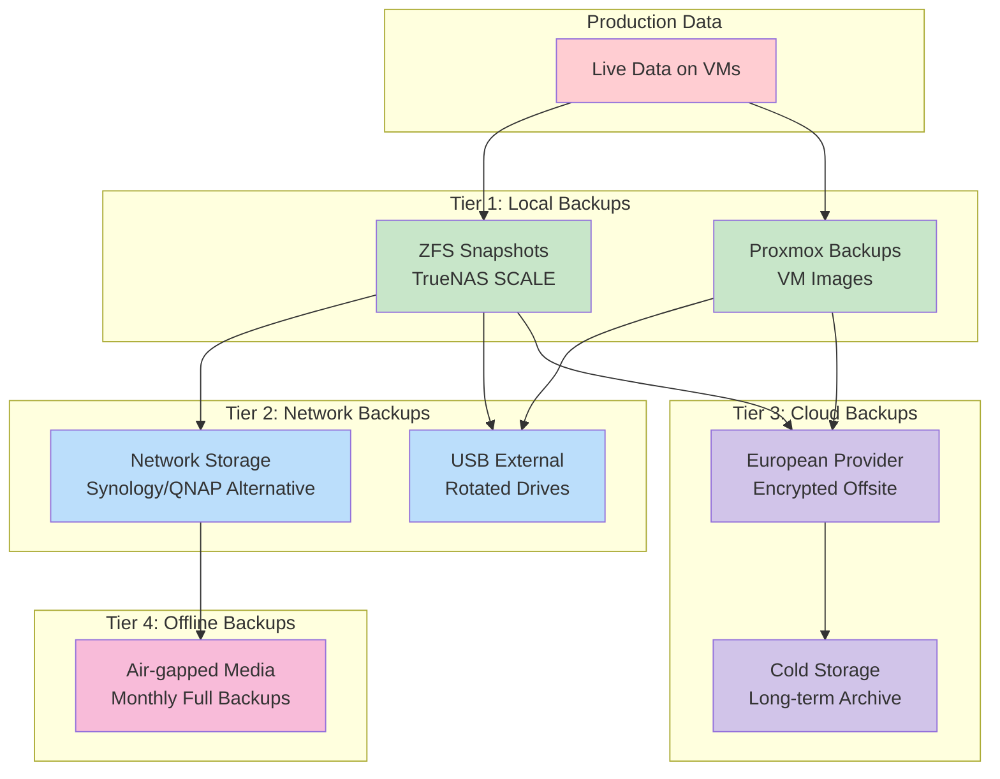

# Backup Strategy - tehzombijesus.ca Home Lab

## 🛡️ Backup Philosophy

This home lab implements a **comprehensive multi-tier backup strategy** following industry best practices to protect against hardware failures, human error, ransomware, and natural disasters. The strategy balances protection, performance, and cost-effectiveness.

## 📐 Backup Architecture Overview

### **3-2-1-1 Backup Rule Implementation**

```
Enhanced 3-2-1-1 Rule:
├── 3 Copies: Original + 2 backups minimum
├── 2 Different Media: Local NVMe + Cloud storage
├── 1 Offsite: European cloud provider
└── 1 Offline: Air-gapped snapshots + encrypted archives
```



---

## 🏠 Local Backup Strategy (Tier 1)

### **ZFS Snapshot Management (TrueNAS)**

**Automated Snapshot Schedule:**
```
Frequency-based Snapshots:
├── Every 15 minutes: 4 snapshots (1 hour retention)
├── Hourly: 24 snapshots (24 hours retention)  
├── Daily: 7 snapshots (1 week retention)
├── Weekly: 4 snapshots (1 month retention)
├── Monthly: 12 snapshots (1 year retention)
└── Yearly: 5 snapshots (5 years retention)
```

**Dataset-Specific Policies:**

**Media Dataset (Movies, TV, Music):**
```yaml
Dataset: /mnt/pool/media
Snapshot Policy:
  hourly: 6 (changed content only)
  daily: 7 (full dataset)
  weekly: 4 (integrity verification)
  monthly: 12 (long-term retention)
Retention: 1 year (media can be re-acquired)
Compression: lz4 (fast, reasonable ratio)
Deduplication: disabled (media files rarely duplicate)
```

**Documents Dataset (Paperless):**
```yaml
Dataset: /mnt/pool/documents  
Snapshot Policy:
  every_15min: 4 (active document processing)
  hourly: 24 (recent changes)
  daily: 30 (extended retention)
  weekly: 12 (quarterly access)
  monthly: 24 (2-year retention)
Retention: 2 years (critical business documents)
Compression: gzip-9 (maximum compression for text)
Deduplication: enabled (similar documents)
```

**Configuration Dataset (System configs):**
```yaml
Dataset: /mnt/pool/configs
Snapshot Policy:
  hourly: 48 (rapid configuration changes)
  daily: 14 (2-week retention)  
  weekly: 8 (2-month retention)
  monthly: 12 (1-year retention)
Retention: 1 year (critical system configurations)
Compression: gzip-6 (balance of speed/compression)
Deduplication: enabled (many similar config files)
```

**Snapshot Management Automation:**
```bash
#!/bin/bash
# /opt/scripts/zfs-snapshot-manager.sh

# Create snapshots with consistent naming
zfs snapshot pool/media@$(date +%Y%m%d_%H%M)_auto
zfs snapshot pool/documents@$(date +%Y%m%d_%H%M)_auto  
zfs snapshot pool/configs@$(date +%Y%m%d_%H%M)_auto

# Clean up old snapshots based on retention policy
/opt/scripts/cleanup-snapshots.py --dataset pool/media --keep-hourly 6
/opt/scripts/cleanup-snapshots.py --dataset pool/documents --keep-hourly 24
/opt/scripts/cleanup-snapshots.py --dataset pool/configs --keep-hourly 48

# Verify snapshot integrity
zfs scrub pool
```

### **Proxmox VM Backup System**

**VM Backup Configuration:**
```yaml
Backup Schedule:
  timing: Daily at 2:00 AM (low activity period)
  mode: snapshot (consistent point-in-time)
  compression: gzip (good ratio, reasonable speed)
  notification: email on completion/failure
  
Storage Target: TrueNAS NFS share
Path: /mnt/pool/backups/proxmox
Retention: 
  daily: 7 backups
  weekly: 4 backups  
  monthly: 3 backups
```

**Per-VM Backup Policies:**

**Critical VMs (TrueNAS, Docker Services):**
```yaml
Backup Frequency: Daily
Backup Mode: stop (ensure consistency)
Retention: 14 daily + 8 weekly + 6 monthly
Priority: High (backup before other VMs)
Verification: Automatic backup integrity check
```

**Standard VMs (Plex, Pterodactyl, Media Automation):**
```yaml
Backup Frequency: Daily
Backup Mode: snapshot (minimize downtime)  
Retention: 7 daily + 4 weekly + 3 monthly
Priority: Normal
Verification: Weekly integrity verification
```

**Backup Verification Script:**
```bash
#!/bin/bash
# /opt/scripts/verify-proxmox-backups.sh

BACKUP_DIR="/mnt/pve/truenas-nfs/backups"
LOG_FILE="/var/log/backup-verification.log"

echo "$(date): Starting backup verification" >> $LOG_FILE

for backup in $BACKUP_DIR/vzdump-*.tar.gz; do
    # Test archive integrity
    if tar -tzf "$backup" >/dev/null 2>&1; then
        echo "$(date): PASS - $backup integrity verified" >> $LOG_FILE
    else
        echo "$(date): FAIL - $backup is corrupted" >> $LOG_FILE
        # Send alert email
        mail -s "Backup Corruption Alert" admin@tehzombijesus.ca < $LOG_FILE
    fi
done

echo "$(date): Backup verification complete" >> $LOG_FILE
```

---

## 🌐 Network Backup Strategy (Tier 2)

### **External USB Rotation System**

**Hardware Setup:**
```
USB Drives: 3 x 4TB USB 3.1 external drives
Rotation Schedule: Weekly rotation
Storage Location: 
  - Drive A: Connected to TrueNAS (active)
  - Drive B: Stored offsite (family member's house)
  - Drive C: Stored in fireproof safe (home)

Encryption: LUKS full-disk encryption
File System: ext4 (Linux compatibility)
Labels: BACKUP_A, BACKUP_B, BACKUP_C
```

**Rotation Procedure:**
```
Weekly Rotation (Every Sunday):
1. Unmount current USB drive from TrueNAS
2. Store current drive in fireproof safe
3. Retrieve next drive from safe
4. Connect new drive to TrueNAS  
5. Mount and verify encryption
6. Start incremental sync process
7. Update rotation log

Monthly Offsite Rotation:
1. Swap offsite drive with home safe drive
2. Verify offsite drive integrity before transport
3. Update offsite storage location log
4. Test restoration from offsite backup
```

**USB Backup Sync Script:**
```bash
#!/bin/bash
# /opt/scripts/usb-backup-sync.sh

USB_MOUNT="/mnt/usb-backup"
SOURCE_DATASETS=("/mnt/pool/media" "/mnt/pool/documents" "/mnt/pool/configs")
LOG_FILE="/var/log/usb-backup.log"

# Verify USB drive is mounted and encrypted
if [ ! -d "$USB_MOUNT" ]; then
    echo "$(date): ERROR - USB backup drive not mounted" >> $LOG_FILE
    exit 1
fi

# Sync each dataset with progress tracking
for dataset in "${SOURCE_DATASETS[@]}"; do
    dataset_name=$(basename "$dataset")
    
    echo "$(date): Starting sync of $dataset_name" >> $LOG_FILE
    
    rsync -avH --progress --delete \
          --exclude="*.tmp" \
          --exclude=".zfs/" \
          "$dataset/" \
          "$USB_MOUNT/$dataset_name/" \
          >> $LOG_FILE 2>&1
    
    if [ $? -eq 0 ]; then
        echo "$(date): SUCCESS - $dataset_name sync completed" >> $LOG_FILE
    else
        echo "$(date): ERROR - $dataset_name sync failed" >> $LOG_FILE
        # Send alert
        mail -s "USB Backup Failure" admin@tehzombijesus.ca < $LOG_FILE
    fi
done

# Create backup manifest
echo "$(date): Creating backup manifest" >> $LOG_FILE
find "$USB_MOUNT" -type f -exec sha256sum {} \; > "$USB_MOUNT/backup-manifest-$(date +%Y%m%d).sha256"

echo "$(date): USB backup sync completed" >> $LOG_FILE
```

### **Network Attached Storage (Future Expansion)**

**Planned NAS Integration:**
```
Target: Synology DS920+ or QNAP TS-464
Storage: 4 x 4TB WD Red Pro (RAID 5)
Connection: Gigabit Ethernet (10Gb future)
Purpose: Dedicated backup target + media expansion

Backup Features:
├── Hyper Backup: Synology's backup solution
├── Cloud Sync: Integration with cloud providers  
├── Snapshot Replication: ZFS-like snapshots
├── Version Control: File-level versioning
└── Offsite Replication: Between multiple NAS units
```

---

## ☁️ Cloud Backup Strategy (Tier 3)

### **European Cloud Provider Selection**

**Provider Criteria:**
```
Legal Requirements:
├── GDPR Compliance: Full EU data protection compliance
├── Data Residency: Data stored within EU borders
├── Privacy Policy: No-logs, zero-knowledge architecture
├── Jurisdiction: EU legal jurisdiction (not US/5-eyes)
└── Transparency: Regular transparency reports

Technical Requirements:
├── Encryption: Client-side encryption before upload
├── Versioning: Multiple file versions retained
├── API Access: Programmatic backup automation
├── Bandwidth: Unlimited upload/download
└── Redundancy: Geographic replication within EU
```

**Recommended Providers:**
```
Primary Choice: pCloud (Switzerland)
├── Jurisdiction: Swiss privacy laws
├── Encryption: Client-side crypto (pCloud Crypto)
├── Storage: Unlimited plans available  
├── EU Servers: Multiple data centers in EU
└── API: Full REST API for automation

Alternative: Tresorit (Hungary)  
├── Jurisdiction: EU (Hungary)
├── Encryption: Zero-knowledge, client-side
├── Compliance: GDPR, SOC 2, ISO 27001
├── Business Grade: Enterprise features
└── Sync: Real-time file synchronization

Budget Option: Icedrive (UK - pre-Brexit setup)
├── Jurisdiction: UK (GDPR-compliant)
├── Encryption: Client-side AES-256
├── Storage: Competitive pricing
├── Features: Versioning, sharing controls
└── API: RESTful API available
```

### **Cloud Backup Implementation**

**Encryption Strategy:**
```bash
#!/bin/bash
# /opt/scripts/cloud-backup-encrypt.sh

# Pre-encryption using GPG before cloud upload
SOURCE_DIR="/mnt/pool"
STAGING_DIR="/tmp/cloud-backup-staging"  
CLOUD_DIR="/mnt/cloud-provider"

# Create encrypted archive of each dataset
for dataset in media documents configs; do
    echo "Encrypting $dataset for cloud backup..."
    
    # Create compressed tar archive
    tar -czf "$STAGING_DIR/${dataset}-$(date +%Y%m%d).tar.gz" \
        -C "$SOURCE_DIR" "$dataset"
    
    # Encrypt with GPG (symmetric encryption)
    gpg --cipher-algo AES256 --compress-algo 1 \
        --symmetric --output "$STAGING_DIR/${dataset}-$(date +%Y%m%d).tar.gz.gpg" \
        "$STAGING_DIR/${dataset}-$(date +%Y%m%d).tar.gz"
    
    # Remove unencrypted archive
    rm "$STAGING_DIR/${dataset}-$(date +%Y%m%d).tar.gz"
    
    # Upload to cloud provider
    rclone copy "$STAGING_DIR/${dataset}-$(date +%Y%m%d).tar.gz.gpg" \
               "cloud-provider:backups/$(date +%Y)/$(date +%m)/"
    
    # Verify upload integrity
    rclone checksum sha256 "$STAGING_DIR/${dataset}-$(date +%Y%m%d).tar.gz.gpg" \
                           "cloud-provider:backups/$(date +%Y)/$(date +%m)/"
done
```

**Cloud Sync Configuration (rclone):**
```ini
# /root/.config/rclone/rclone.conf
[cloud-provider]
type = webdav
url = https://webdav.pcloud.com
vendor = pcloud
user = backup@tehzombijesus.ca
pass = [ENCRYPTED_PASSWORD]

# Bandwidth limiting during business hours
bwlimit = 08:00,18:00 10M 18:00,08:00 off

# Retry configuration
retries = 5
low_level_retries = 10
```

**Automated Cloud Backup Schedule:**
```cron
# /etc/cron.d/cloud-backup
# Nightly cloud backup at 3:00 AM (after local backups)
0 3 * * * root /opt/scripts/cloud-backup-encrypt.sh

# Weekly verification at 4:00 AM Sunday
0 4 * * 0 root /opt/scripts/cloud-backup-verify.sh

# Monthly cleanup at 2:00 AM first day of month  
0 2 1 * * root /opt/scripts/cloud-backup-cleanup.sh
```

### **Cloud Storage Organization**

**Directory Structure:**
```
cloud-provider:backups/
├── 2024/
│   ├── 01/ (January)
│   │   ├── media-20240101.tar.gz.gpg
│   │   ├── documents-20240101.tar.gz.gpg
│   │   └── configs-20240101.tar.gz.gpg
│   ├── 02/ (February)
│   └── ... (monthly organization)
├── 2025/
│   └── ... (yearly organization)
├── emergency/
│   ├── vm-templates/ (critical VM templates)
│   ├── certificates/ (SSL certificates)
│   └── recovery-keys/ (encryption keys backup)
└── archive/
    ├── old-configs/ (historical configurations)
    └── deprecated/ (old system backups)
```

**Retention Policy:**
```yaml
Cloud Retention Schedule:
  daily: 30 days (current month + buffer)
  weekly: 12 weeks (3 months of weekly backups)
  monthly: 24 months (2 years of monthly backups)  
  yearly: 7 years (long-term archive)

Storage Optimization:
  compression: gzip -9 (maximum compression)
  encryption: GPG AES256 (client-side)
  deduplication: file-level checksums
  bandwidth: rate-limited during peak hours
```

---

## 🔒 Offline Backup Strategy (Tier 4)

### **Air-Gapped Backup Media**

**Monthly Offline Backups:**
```
Media Type: 4TB USB drives (dedicated offline rotation)
Schedule: First Sunday of each month
Encryption: LUKS + GPG dual encryption
Storage: Bank safety deposit box + home fireproof safe
Retention: 12 months (replace oldest monthly)

Contents:
├── Full VM backups (compressed)
├── Configuration exports
├── Critical documents archive
├── Certificate backups
├── Recovery documentation
└── Restoration scripts
```

**Offline Backup Process:**
```bash
#!/bin/bash
# /opt/scripts/offline-backup.sh

OFFLINE_MOUNT="/mnt/offline-backup"
BACKUP_DATE=$(date +%Y%m%d)
LOG_FILE="/var/log/offline-backup.log"

echo "$(date): Starting monthly offline backup" >> $LOG_FILE

# Mount encrypted offline drive
cryptsetup open /dev/sdX offline-backup
mount /dev/mapper/offline-backup $OFFLINE_MOUNT

# Create monthly backup directory
mkdir -p "$OFFLINE_MOUNT/monthly-$BACKUP_DATE"

# Backup Proxmox VMs
echo "$(date): Backing up Proxmox VMs" >> $LOG_FILE
cp -r /var/lib/vz/dump/* "$OFFLINE_MOUNT/monthly-$BACKUP_DATE/vm-backups/"

# Backup TrueNAS configurations
echo "$(date): Backing up TrueNAS configs" >> $LOG_FILE
cp /mnt/pool/configs/truenas-config-*.db "$OFFLINE_MOUNT/monthly-$BACKUP_DATE/"

# Backup critical documents (encrypted)
echo "$(date): Backing up critical documents" >> $LOG_FILE  
tar -czf - /mnt/pool/documents | \
    gpg --cipher-algo AES256 --symmetric \
        --output "$OFFLINE_MOUNT/monthly-$BACKUP_DATE/documents-encrypted.tar.gz.gpg"

# Create backup manifest and integrity hashes
echo "$(date): Creating backup manifest" >> $LOG_FILE
find "$OFFLINE_MOUNT/monthly-$BACKUP_DATE" -type f \
    -exec sha256sum {} \; > "$OFFLINE_MOUNT/monthly-$BACKUP_DATE/manifest.sha256"

# Unmount and secure
sync
umount $OFFLINE_MOUNT  
cryptsetup close offline-backup

echo "$(date): Monthly offline backup completed" >> $LOG_FILE
```

### **Disaster Recovery Media**

**Emergency Recovery Kit:**
```
Contents:
├── Proxmox VE ISO (latest stable)
├── TrueNAS SCALE ISO (latest stable)
├── Ubuntu Server 22.04 LTS ISO
├── System recovery documentation (printed)
├── Hardware drivers and firmware
├── Network configuration details
├── Encryption key recovery information  
└── Emergency contact information

Storage:
├── Primary Kit: Fireproof safe (home)
├── Secondary Kit: Offsite location
├── Digital Copy: Encrypted cloud storage
└── Documentation: Physical printout
```

---

## 🔄 Backup Automation & Monitoring

### **Centralized Backup Orchestration**

**Backup Controller Script:**
```bash
#!/bin/bash
# /opt/scripts/backup-orchestrator.sh

LOG_DIR="/var/log/backups"
mkdir -p $LOG_DIR

# Phase 1: Local snapshots (TrueNAS)
echo "$(date): Starting Phase 1 - Local snapshots"
/opt/scripts/zfs-snapshot-manager.sh > "$LOG_DIR/snapshots-$(date +%Y%m%d).log" 2>&1

# Phase 2: VM backups (Proxmox) 
echo "$(date): Starting Phase 2 - VM backups"
/opt/scripts/proxmox-backup.sh > "$LOG_DIR/vm-backup-$(date +%Y%m%d).log" 2>&1

# Phase 3: USB sync (if drive available)
if [ -d "/mnt/usb-backup" ]; then
    echo "$(date): Starting Phase 3 - USB sync"
    /opt/scripts/usb-backup-sync.sh > "$LOG_DIR/usb-sync-$(date +%Y%m%d).log" 2>&1
fi

# Phase 4: Cloud backup (nightly)
if [ $(date +%H) -eq 3 ]; then
    echo "$(date): Starting Phase 4 - Cloud backup"
    /opt/scripts/cloud-backup-encrypt.sh > "$LOG_DIR/cloud-backup-$(date +%Y%m%d).log" 2>&1
fi

# Phase 5: Generate backup report
/opt/scripts/backup-status-report.sh

echo "$(date): Backup orchestration completed"
```

### **Backup Monitoring & Alerting**

**Health Check Dashboard:**
```python
#!/usr/bin/env python3
# /opt/scripts/backup-health-monitor.py

import json, datetime, smtplib
from email.mime.text import MIMEText

class BackupMonitor:
    def __init__(self):
        self.status = {
            'local_snapshots': self.check_zfs_snapshots(),
            'vm_backups': self.check_proxmox_backups(), 
            'usb_sync': self.check_usb_backups(),
            'cloud_sync': self.check_cloud_backups(),
            'disk_space': self.check_storage_capacity()
        }
    
    def check_zfs_snapshots(self):
        # Verify recent snapshots exist for each dataset
        datasets = ['pool/media', 'pool/documents', 'pool/configs']
        status = {}
        
        for dataset in datasets:
            latest = self.get_latest_snapshot(dataset)
            age = self.get_snapshot_age(latest)
            status[dataset] = {
                'latest_snapshot': latest,
                'age_hours': age,
                'status': 'OK' if age < 2 else 'STALE'
            }
        
        return status
    
    def generate_report(self):
        report = f"""
        Backup Health Report - {datetime.datetime.now().strftime('%Y-%m-%d %H:%M')}
        
        LOCAL SNAPSHOTS:
        {self.format_snapshot_status()}
        
        VM BACKUPS:
        {self.format_vm_backup_status()}
        
        CLOUD SYNC:
        {self.format_cloud_status()}
        
        STORAGE CAPACITY:
        {self.format_storage_status()}
        """
        
        return report
    
    def send_alerts(self):
        if self.has_critical_issues():
            self.send_email_alert(self.generate_alert_report())

if __name__ == "__main__":
    monitor = BackupMonitor()
    print(monitor.generate_report())
    monitor.send_alerts()
```

**Backup Status Dashboard (Uptime Kuma Integration):**
```yaml
# Backup service monitors in Uptime Kuma
monitors:
  - name: "ZFS Snapshots"
    type: "http"
    url: "http://10.0.0.10:9000/api/v2.0/pool/dataset/snapshots"
    interval: 3600  # Check hourly
    
  - name: "Proxmox Backups"  
    type: "push"
    url: "heartbeat URL from backup script"
    interval: 86400  # Check daily
    
  - name: "Cloud Backup Sync"
    type: "keyword"
    url: "script that checks cloud sync status"
    keyword: "SUCCESS"
    interval: 86400  # Check daily
    
  - name: "USB Backup Available"
    type: "filesystem"
    path: "/mnt/usb-backup"
    interval: 3600  # Check hourly
```

---

## 🚨 Disaster Recovery Procedures

### **Recovery Scenarios & Procedures**

**Scenario 1: Single VM Failure**
```
Recovery Steps:
1. Identify failed VM from monitoring alerts
2. Attempt VM restart from Proxmox interface
3. If restart fails, restore from latest backup:
   - Stop failed VM completely
   - Restore VM from backup storage
   - Verify configuration and networking
   - Start restored VM and monitor
4. Update documentation with incident details

Recovery Time: 15-30 minutes
Data Loss: <24 hours (daily backup frequency)
```

**Scenario 2: Storage Pool Failure**
```
Recovery Steps:
1. Assess extent of storage failure
2. If single drive failure in RAID 1:
   - Replace failed drive immediately
   - Rebuild RAID array
   - Verify data integrity
3. If complete storage failure:
   - Install new storage drives
   - Restore TrueNAS from VM backup
   - Restore datasets from USB/cloud backups
   - Verify all services can access restored data

Recovery Time: 2-6 hours (depending on data size)
Data Loss: <7 days (weekly USB rotation)
```

**Scenario 3: Complete System Failure**
```
Recovery Steps:
1. Acquire replacement hardware (HP EliteDesk 800 G5 or similar)
2. Install Proxmox VE from recovery media
3. Restore TrueNAS VM from backup
4. Restore all datasets from most recent cloud backup
5. Restore remaining VMs from Proxmox backups
6. Reconfigure networking and Cloudflare tunnels
7. Verify all services are operational
8. Update DNS records if public IP changed

Recovery Time: 4-12 hours (depending on data size)
Data Loss: <30 days (monthly offline backup cycle)
```

**Scenario 4: Ransomware Attack**
```
Recovery Steps:
1. Immediately isolate affected systems from network
2. Identify scope of encryption/damage
3. Do NOT pay ransom - proceed with recovery
4. Restore VMs from pre-infection backups
5. Restore data from air-gapped offline backups
6. Scan all restored systems before reconnecting
7. Implement additional security measures
8. Document attack vector and improve defenses

Recovery Time: 6-24 hours
Data Loss: Minimal (air-gapped backups unaffected)
```

### **Recovery Testing Schedule**

**Monthly Recovery Tests:**
```
Test Schedule:
├── Week 1: Single file restoration from ZFS snapshots
├── Week 2: Single VM restoration from backup
├── Week 3: Dataset restoration from USB backup
└── Week 4: Cloud backup download and verification
```

**Quarterly Disaster Recovery Drills:**
```
Drill Scenarios:
├── Q1: Complete VM restoration on test hardware
├── Q2: Network configuration recovery
├── Q3: Data restoration from encrypted cloud backup  
└── Q4: Full system rebuild simulation
```

**Annual Recovery Validation:**
```
Comprehensive Tests:
├── Complete system recovery on identical hardware
├── Cross-platform restoration (different hypervisor)
├── Backup integrity verification (all tiers)
├── Documentation accuracy verification
└── Recovery time measurement and optimization
```

---

## 📊 Backup Storage Economics

### **Cost Analysis**

**Local Storage Costs:**
```
Initial Investment:
├── 2TB NVMe RAID 1: $400 (Samsung 980 PRO)
├── 3x 4TB USB drives: $300 ($100 each)
├── Fireproof safe: $200 (backup storage)
└── Total: $900

Annual Costs:
├── Drive replacement: $100/year (warranty expiration)
├── Power consumption: $8/year (USB drives, rotation)
└── Total: $108/year
```

**Cloud Storage Costs:**
```
pCloud Annual Plans:
├── 500GB: $47.88/year ($3.99/month)
├── 2TB: $95.88/year ($7.99/month)  
├── 10TB: $359.88/year ($29.99/month)
└── Unlimited: $599.88/year ($49.99/month)

Selected: 2TB plan = $96/year
Estimated Usage: 1.2TB compressed/encrypted
Growth Rate: 200GB/year
```

**Total Backup TCO (5 years):**
```
Local Backups: $900 + ($108 × 5) = $1,440
Cloud Storage: $96 × 5 = $480
Offsite Rotation: $50/year × 5 = $250
Total 5-year cost: $2,170

Cost per GB protected: $2,170 ÷ 2,000GB = $1.09/GB
Equivalent cloud-only solution: $3,000+/year
Annual savings vs cloud-only: $2,500+
```

### **ROI Analysis**

**Data Recovery Value:**
```
Critical Data Categories:
├── Documents: $50,000 (business/legal/personal)
├── Media Library: $15,000 (replacement cost)
├── Configurations: $5,000 (time to recreate)  
├── Personal Photos: Priceless
└── System Knowledge: $10,000 (consulting equivalent)

Total Protected Value: $80,000+
Backup Investment: $2,170 (5 years)
Protection Ratio: 37:1 return on investment
```

---

This comprehensive backup strategy ensures your home lab data is protected against all common failure scenarios while maintaining cost-effectiveness and ease of management. The multi-tier approach provides redundancy without complexity, and the automated systems ensure backups happen consistently without manual intervention.
