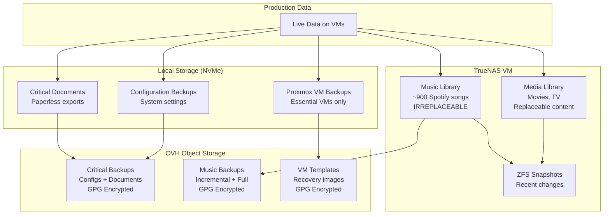

# Backup Strategy - tehzombijesus.ca Home Lab v2.0

## 🛡️ Backup Philosophy

This home lab implements a **cost-optimized two-tier backup strategy** using local storage efficiently and OVH Object Storage for critical data protection. The strategy prioritizes irreplaceable data (configurations, documents, music) while using TrueNAS primarily for replaceable media storage with local snapshot protection.

## 📐 Backup Architecture Overview

### **Enhanced 3-2-1 Rule Implementation**

```
Cost-Optimized 3-2-1 Rule:
├── 3 Copies: Original + Local snapshots/backups + OVH cloud
├── 2 Different Media: Local NVMe + OVH Object Storage (S3)
└── 1 Offsite: OVH Object Storage with client-side encryption
```



---

## 🏠 Local Storage Strategy

### **NVMe Storage Allocation (1TB usable)**

```
NVMe Storage Distribution:
├── Proxmox Host: 200GB
│   ├── Proxmox OS: 32GB
│   ├── VM Backups: 100GB (critical VMs only)
│   ├── ISO Storage: 30GB
│   └── Snapshots: 38GB
├── VM Operating Systems: 500GB
│   ├── TrueNAS: 100GB (OS + minimal data)
│   ├── Pterodactyl: 150GB (game worlds + backups)
│   ├── Docker Services: 100GB (containers + volumes)
│   ├── Plex: 100GB (metadata + thumbnails)
│   └── Media Automation: 50GB (temp processing)
├── Local Backups: 200GB
│   ├── Configuration exports: 50GB
│   ├── Document backups: 50GB
│   ├── Critical data staging: 100GB
└── Available: 100GB (expansion buffer)
```

### **Local Backup Strategy**

**Critical VM Backups (Local NVMe):**
```yaml
Backup Targets: Docker Services VM (103), TrueNAS VM (104) only
Frequency: Daily at 2:00 AM
Retention: 
  - 7 daily backups (1 week)
  - 4 weekly backups (1 month total)
Storage: /var/lib/vz/dump/ (Proxmox local)
Size: ~15GB per backup set
```

**Configuration Backup System:**
- **Location**: `/opt/scripts/backups/config-backup.sh`
- **Frequency**: Daily at 2:30 AM
- **Retention**: 14 days local, 30 days cloud (cost optimization)
- **Contents**: Proxmox configs, VM configs, container configs, network settings

---

## 🗄️ TrueNAS Storage Strategy

### **TrueNAS Dataset Organization**

```
TrueNAS Pool Layout (1.8TB):
├── Media Dataset: 1.25TB (movies/TV - replaceable)
│   ├── Movies: ~800GB
│   ├── TV Shows: ~400GB
│   └── Books/Audiobooks: ~50GB
├── Music Dataset: 150GB (PRIORITY - irreplaceable)
│   ├── Spotify collection: ~900 songs
│   ├── Personal recordings/remixes
│   └── Lossless audio files
├── Documents: 200GB (Paperless-ngx)
│   ├── Processed documents
│   └── OCR cache
├── Backups: 100GB (staging for cloud upload)
│   ├── Config exports from other VMs
│   └── Critical document exports
└── System: 100GB (TrueNAS OS and logs)
```

### **Enhanced Snapshot Policies**

**Music Dataset Snapshots (High Protection):**
```yaml
Music Dataset Snapshots:
  every_hour: 12 snapshots (12 hours - active music management)
  daily: 14 snapshots (2 weeks - recent additions)
  weekly: 8 snapshots (2 months - library changes)
  monthly: 6 snapshots (6 months - seasonal cleanup)
  
Rationale: Music is irreplaceable, needs maximum local protection
```

**Media Dataset Snapshots (Basic Protection):**
```yaml
Media Dataset Snapshots:
  daily: 3 snapshots (3 days - recent downloads)
  weekly: 2 snapshots (2 weeks - library additions)
  
Rationale: Movies/TV can be re-acquired, minimal protection needed
```

**Documents Dataset Snapshots (High Protection):**
```yaml
Documents Dataset Snapshots:
  every_15min: 4 (1 hour - active document processing)
  hourly: 24 (1 day - document changes)
  daily: 7 (1 week - document history)
  weekly: 4 (1 month - long-term document retention)
  
Rationale: Documents are unique and business-critical
```

---

## ☁️ OVH Object Storage Strategy

### **Why OVH Over Contabo**

**Cost Comparison for 46GB Usage:**
```
Annual Costs:
├── OVH Standard: $5.32/year (pay-per-GB)
├── Contabo: $39.11/year (250GB fixed)
└── Annual Savings: $33.79 with OVH
```

**OVH Advantages:**
- 85% cost reduction for current usage
- Room to grow to 338GB before Contabo becomes cheaper
- Pay-per-GB model scales with actual usage
- Free egress until January 2026

### **OVH S3 Configuration**

**Storage Account Setup:**
```
Provider: OVH Object Storage
Region: GRA (Gravelines, France - GDPR compliant)
Tier: Standard Object Storage ($0.009636/GB/month)
API: S3-compatible interface
Encryption: Client-side GPG before upload
```

**S3 Client Configuration (rclone):**
```ini
# /root/.config/rclone/rclone.conf
[ovh-s3]
type = s3
provider = Other
access_key_id = [YOUR_OVH_ACCESS_KEY]
secret_access_key = [YOUR_OVH_SECRET_KEY]
endpoint = https://s3.gra.cloud.ovh.net
region = gra
location_constraint = gra

# Upload optimization for pay-per-GB model
upload_concurrency = 2
chunk_size = 32M
disable_checksum = false
```

### **GPG Encryption Setup**

**Generate Backup Encryption Key:**
```bash
# Generate dedicated backup key
gpg --full-generate-key --expert
# Choose: (1) RSA and RSA, 4096 bits, no expiration
# User ID: backup@tehzombijesus.ca
# Strong passphrase stored in secure location

# Export public key for backup
gpg --export --armor backup@tehzombijesus.ca > /root/backup-public-key.asc

# Test encryption/decryption
echo "test" | gpg --encrypt --recipient backup@tehzombijesus.ca | gpg --decrypt
```

### **Enhanced Backup Implementation**

**Script Structure:**
```
/opt/scripts/backups/
├── config-backup.sh           # System configuration backup
├── truenas-backup-prep.sh     # TrueNAS backup preparation
├── ovh-backup.sh              # Main OVH upload script
├── ovh-cost-monitor.sh        # Cost tracking and alerts
├── backup-health-check.sh     # System health monitoring
├── backup-verification.sh     # Post-backup verification
├── backup-status-report.sh    # Daily status reports
├── cleanup-local-backups.sh   # Local cleanup maintenance
├── monthly-backup-audit.sh    # Monthly full audit
└── quarterly-recovery-test.sh # Recovery testing
```

**Music Backup Strategy:**
- **Incremental backups**: Weekly (Wednesdays) - only changed files
- **Full backups**: Monthly (first Wednesday) - complete library
- **Cost optimization**: Reduces redundant data upload
- **Priority protection**: Music gets both local snapshots + cloud backup

### **Cloud Storage Organization**

```
ovh-s3:homelab-backups/
├── 2025/
│   ├── 01/ (January)
│   │   ├── configs-20250101.tar.gz.gpg
│   │   ├── documents-20250101.tar.gz.gpg
│   │   ├── music-incremental-20250108.tar.gz.gpg
│   │   ├── music-full-20250108.tar.gz.gpg (first Wed)
│   │   └── vm-templates-20250105.tar.gz.gpg (Sundays)
│   ├── 02/ (February)
│   └── ... (monthly organization)
├── 2026/
└── recovery/
    ├── system-recovery-guide.txt
    ├── network-configs/
    ├── gpg-keys/
    └── emergency-contacts.txt
```

---

## 🔄 Backup Automation Schedule

### **Optimized Cron Schedule**

```cron
# Daily Backup Routine (Staggered)
30 1 * * * root /opt/scripts/backups/truenas-backup-prep.sh
0  2 * * * root vzdump 103 104 --mode snapshot --compress gzip --storage local
30 2 * * * root /opt/scripts/backups/config-backup.sh
0  3 * * * root /opt/scripts/backups/ovh-backup.sh
30 3 * * * root /opt/scripts/backups/backup-verification.sh
0  4 * * * root /opt/scripts/backups/backup-status-report.sh

# Weekly Specialized Backups
0 3 * * 3 root /opt/scripts/backups/ovh-backup.sh  # Music (Wednesday)
0 3 * * 0 root /opt/scripts/backups/ovh-backup.sh  # VM Templates (Sunday)

# Monitoring and Maintenance
0 */6 * * * root /opt/scripts/backups/backup-health-check.sh
0 9 * * 1   root /opt/scripts/backups/ovh-cost-monitor.sh     # Monday reports
0 5 * * 0   root /opt/scripts/backups/cleanup-local-backups.sh
0 6 1 * *   root /opt/scripts/backups/monthly-backup-audit.sh
```

---

## 💰 Cost Analysis & Optimization

### **Storage Economics**

**Current Usage Breakdown:**
```
OVH Object Storage Estimate (Annual):
├── Daily configs: 50MB × 30 days = 1.5GB
├── Daily documents: 100MB × 60 days = 6GB
├── Weekly music incremental: 200MB × 8 weeks = 1.6GB
├── Monthly music full: 1GB × 6 months = 6GB
├── Weekly VM templates: 2GB × 16 weeks = 32GB
└── Total: ~47GB

Cost Calculation:
├── Monthly: 47GB × $0.009636 = $0.45
├── Annual: $0.45 × 12 = $5.40
└── vs Contabo: $39.11 - $5.40 = $33.71 savings/year
```

**Cost Monitoring & Alerts:**
```yaml
Budget Thresholds:
  Monthly Alert: $2.00 (safety margin)
  Annual Budget: $20.00 (still cheaper than Contabo)
  
Monitoring Features:
  - Real-time cost calculation
  - Weekly cost reports
  - Budget alerts via email
  - Growth projection analysis
```

**Break-even Analysis:**
```
OVH becomes more expensive than Contabo at: 338GB
Current usage: 47GB
Growth headroom: 291GB (620% increase possible)
Time to break-even: Several years at current growth rate
```

### **Retention Policy Optimization (Cost-Aware)**

**Aggressive Retention for Cost Control:**
```yaml
Critical Configurations:
  Local: 14 days (vs 90 days with Contabo)
  Cloud: 30 days (vs 90 days with Contabo)
  
Documents:
  Local: 7 days
  Cloud: 60 days (vs 90 days with Contabo)
  
Music:
  Incremental: 60 days
  Full backups: 180 days
  
VM Templates:
  Cloud: 120 days (vs 365 days with Contabo)
```

---

## 🔐 Security Implementation

### **YubiKey 5 NFC Integration**

**SSH Key Generation:**
```bash
# Generate FIDO2 SSH key on YubiKey
ssh-keygen -t ed25519-sk -O resident -O verify-required \
    -f ~/.ssh/yubikey_backup_key -C "backup-system@tehzombijesus.ca"

# Add to TrueNAS authorized_keys
ssh-copy-id -i ~/.ssh/yubikey_backup_key.pub truenas-vm

# Test authentication with touch requirement
ssh -i ~/.ssh/yubikey_backup_key truenas-vm "echo 'YubiKey SSH successful'"
```

**SSH Configuration:**
```bash
# /root/.ssh/config
Host truenas-vm
    HostName 192.168.1.100
    User root
    IdentityFile ~/.ssh/yubikey_backup_key
    IdentitiesOnly yes
    ConnectTimeout 10
    ServerAliveInterval 60
```

### **GPG Key Management**

**Backup Key Security:**
```bash
# Backup private key to secure location
gpg --export-secret-keys backup@tehzombijesus.ca > /root/secure/backup-private-key.gpg

# Create revocation certificate
gpg --gen-revoke backup@tehzombijesus.ca > /root/secure/backup-key-revocation.asc

# Store passphrase securely (consider hardware security module)
```

---

## 🚨 Recovery Procedures

### **Recovery Scenarios**

**Scenario 1: Single File Recovery (Music Focus)**
```
Music File Recovery Steps:
1. Check TrueNAS music snapshots first (fastest)
   - Browse /mnt/pool/music/.zfs/snapshot/
   - 12 hours of hourly snapshots available
2. Check recent incremental backup (if file is <1 week old)
3. Download and decrypt monthly full backup from OVH
4. Restore from decrypted archive

Recovery Time: 5-30 minutes
Data Loss: Maximum 1 hour (with hourly snapshots)
```

**Scenario 2: Complete Music Library Loss**
```
Full Music Recovery Steps:
1. Download latest monthly full backup from OVH
2. Download all incremental backups since full backup
3. Decrypt all archives using backup GPG key
4. Restore base library from full backup
5. Apply incremental changes in chronological order
6. Verify library completeness with inventory files

Recovery Time: 2-4 hours (depending on library size)
Data Loss: Maximum 1 week (time since last incremental)
```

**Scenario 3: Complete System Loss**
```
Full System Recovery Steps:
1. Acquire replacement hardware
2. Install Proxmox from ISO
3. Configure YubiKey SSH access
4. Download all OVH backups using rclone
5. Decrypt system configurations
6. Restore VM templates and recreate VMs
7. Restore TrueNAS configuration
8. Mount restored datasets
9. Restore music library (priority #1)
10. Restore documents from cloud
11. Re-acquire replaceable media over time

Recovery Time: 
- Essential services: 8-12 hours
- Music library: +2-4 hours
- Full system: 1-2 days (excluding media re-acquisition)
```

### **Recovery Testing Schedule**

**Monthly Recovery Tests:**
```
Week 1: Music file recovery from ZFS snapshots
Week 2: Document recovery from OVH backup
Week 3: VM configuration restoration
Week 4: GPG decryption and key management test
```

**Quarterly Full Recovery Simulation:**
```
Q1: Test complete music library restoration
Q2: Test full system configuration recovery  
Q3: Test YubiKey SSH recovery procedures
Q4: Annual full recovery simulation
```

---

## 📊 Monitoring & Alerting

### **Backup Health Dashboard**

**Key Metrics Monitored:**
```yaml
Storage Metrics:
  - Local NVMe usage (<85% alert)
  - TrueNAS pool health and usage
  - OVH storage usage and costs
  
Backup Success Metrics:
  - Last successful config backup age (<48h)
  - Last successful document backup age (<48h)
  - Last successful music backup age (<1 week)
  - ZFS snapshot counts and ages
  
System Health:
  - YubiKey SSH connectivity to TrueNAS
  - OVH S3 API connectivity
  - GPG key validity and accessibility
```

**Alert Thresholds:**
```yaml
Critical Alerts (Immediate):
  - Backup failure for >48 hours
  - Local storage >90% full
  - OVH monthly cost >$2.00
  - YubiKey SSH failure
  - ZFS pool errors
  
Warning Alerts (Daily Digest):
  - Backup size anomalies (>20% change)
  - Music library changes detected
  - Approaching storage thresholds
  - Cost trending above budget
```

### **Integration with Uptime Kuma**

**Monitoring Endpoints:**
```yaml
monitors:
  - name: "OVH Backup Success"
    type: "script"
    script: "test -f /tmp/ovh-backup-success-$(date +%Y%m%d)"
    interval: 3600
    
  - name: "Music Library Protection"
    type: "script"
    script: "ssh truenas-vm 'zfs list -t snapshot music | grep $(date +%Y%m%d) | wc -l' | grep -v '^0$'"
    interval: 3600
    
  - name: "YubiKey SSH Health"  
    type: "script"
    script: "timeout 30 ssh truenas-vm 'echo OK'"
    interval: 1800
    
  - name: "OVH Cost Monitor"
    type: "script"
    script: "/opt/scripts/backups/ovh-cost-monitor.sh --check-only"
    interval: 14400
```

---

## 📁 Directory Structure & Script Organization

### **Recommended GitHub Repository Structure**

```
home-lab-setup/
├── docs/
│   ├── backup-strategy.md          (this document)
│   ├── recovery-procedures.md
│   ├── cost-analysis.md
│   └── security-implementation.md
├── scripts/
│   └── backups/
│       ├── README.md
│       ├── config-backup.sh
│       ├── truenas-backup-prep.sh
│       ├── ovh-backup.sh
│       ├── ovh-cost-monitor.sh
│       ├── backup-health-check.sh
│       ├── backup-verification.sh
│       ├── backup-status-report.sh
│       ├── cleanup-local-backups.sh
│       ├── monthly-backup-audit.sh
│       ├── quarterly-recovery-test.sh
│       └── install-backup-system.sh
├── configs/
│   ├── cron/
│   │   └── homelab-ovh-backups
│   ├── rclone/
│   │   └── rclone.conf.template
│   ├── ssh/
│   │   └── config.template
│   └── gpg/
│       └── backup-key-generation.md
├── monitoring/
│   ├── uptime-kuma/
│   │   └── backup-monitors.json
│   └── grafana/
│       └── backup-dashboard.json
└── recovery/
    ├── system-recovery-guide.md
    ├── music-recovery-procedures.md
    ├── emergency-contacts.md
    └── recovery-test-reports/
```

### **Installation Script Template**

```bash
#!/bin/bash
# /opt/scripts/backups/install-backup-system.sh

set -e

echo "Installing OVH-based backup system for tehzombijesus.ca home lab..."

# Create directory structure
mkdir -p /opt/scripts/backups
mkdir -p /opt/backups/configs
mkdir -p /var/log/backups

# Install required packages
apt update
apt install -y rclone gpg bc jq curl

# Copy all backup scripts from GitHub
git clone https://github.com/TehZombiJesus/home-lab-setup.git /tmp/home-lab-setup
cp -r /tmp/home-lab-setup/scripts/backups/* /opt/scripts/backups/
chmod +x /opt/scripts/backups/*.sh

# Install cron jobs  
cp /tmp/home-lab-setup/configs/cron/homelab-ovh-backups /etc/cron.d/

# Setup rclone config template
mkdir -p /root/.config/rclone
cp /tmp/home-lab-setup/configs/rclone/rclone.conf.template /root/.config/rclone/

echo "Backup system installed. Next steps:"
echo "1. Configure OVH Object Storage credentials in rclone"
echo "2. Generate GPG backup keys"
echo "3. Setup YubiKey SSH access to TrueNAS"
echo "4. Test backup scripts manually before enabling cron"
echo "5. Configure monitoring alerts"

rm -rf /tmp/home-lab-setup
```

---

## 🎯 Implementation Roadmap

### **Phase 1: Foundation (Week 1)**
1. ✅ Set up OVH Object Storage account
2. ✅ Generate GPG backup encryption keys
3. ✅ Configure rclone with OVH credentials
4. ✅ Create GitHub repository structure
5. ✅ Deploy backup scripts to `/opt/scripts/backups/`

### **Phase 2: Core Backups (Week 2)**  
1. ✅ Implement configuration backup system
2. ✅ Set up TrueNAS backup preparation
3. ✅ Deploy OVH upload script with music priority
4. ✅ Configure YubiKey SSH for TrueNAS access
5. ✅ Test manual backup execution

### **Phase 3: Automation (Week 3)**
1. ✅ Deploy cron schedule
2. ✅ Implement cost monitoring
3. ✅ Set up health checks and alerting
4. ✅ Configure Uptime Kuma monitoring
5. ✅ Test automated backup flow

### **Phase 4: Validation (Week 4)**
1. ✅ Perform recovery testing
2. ✅ Validate cost projections
3. ✅ Document procedures
4. ✅ Train on emergency procedures
5. ✅ Schedule ongoing maintenance

---

This enhanced backup strategy prioritizes your irreplaceable music collection while maintaining cost-effective protection for all critical data. The OVH implementation provides significant cost savings (~$34/year) while ensuring comprehensive data protection and streamlined recovery procedures.
