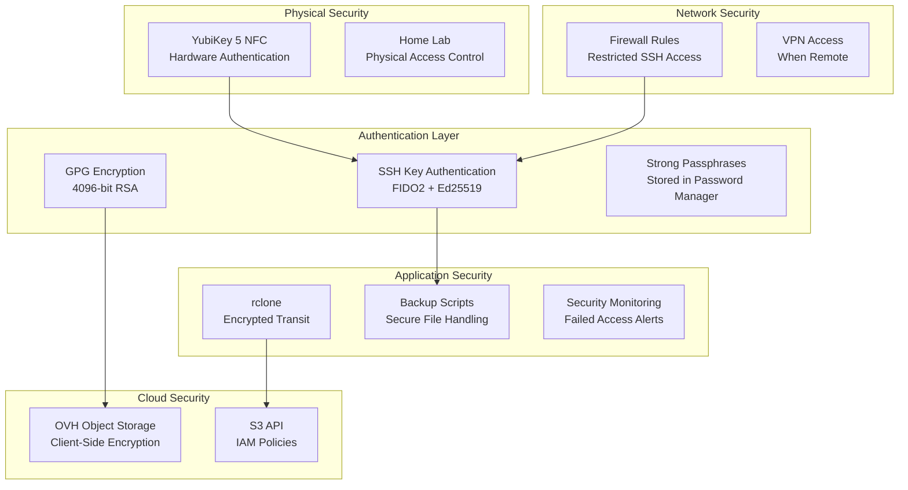
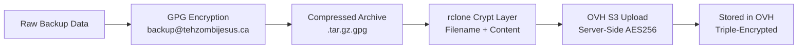

# Security Implementation - tehzombijesus.ca Home Lab Backup Strategy

## 🔐 Security Philosophy

This document outlines the comprehensive security implementation for the home lab backup system, emphasizing **defense in depth**, **zero-trust principles**, and **hardware-backed authentication**. Every backup is encrypted before leaving the local network, with multiple layers of access control protecting critical infrastructure.

## 🛡️ Security Architecture Overview

### **Multi-Layer Security Model**



## 🔑 YubiKey 5 NFC Implementation

### **Hardware Authentication Setup**

**YubiKey Configuration for Backup System:**
```bash
#!/bin/bash
# YubiKey setup for backup system authentication

# Verify YubiKey detection
if ! ykman info >/dev/null 2>&1; then
    echo "ERROR: YubiKey not detected"
    exit 1
fi

echo "Setting up YubiKey 5 NFC for backup system..."

# Configure FIDO2 PIN (if not already set)
ykman fido2 change-pin --new-pin

# Generate FIDO2-resident SSH key
ssh-keygen -t ed25519-sk -O resident -O verify-required \
    -O application=ssh:backup-system \
    -f ~/.ssh/yubikey_backup_ed25519 \
    -C "backup-system@tehzombijesus.ca"

# Backup the SSH public key
cp ~/.ssh/yubikey_backup_ed25519.pub /root/secure/yubikey-backup-pubkey.txt

# Set restrictive permissions
chmod 600 ~/.ssh/yubikey_backup_ed25519*
chmod 700 ~/.ssh/

echo "YubiKey SSH key generated successfully!"
echo "Public key fingerprint:"
ssh-keygen -lf ~/.ssh/yubikey_backup_ed25519.pub
```

### **SSH Configuration Hardening**

**Client SSH Configuration (`/root/.ssh/config`):**
```bash
# Global SSH hardening
Host *
    Protocol 2
    Ciphers chacha20-poly1305@openssh.com,aes256-gcm@openssh.com
    MACs hmac-sha2-256-etm@openssh.com,hmac-sha2-512-etm@openssh.com
    KexAlgorithms curve25519-sha256,curve25519-sha256@libssh.org
    HostKeyAlgorithms rsa-sha2-512,rsa-sha2-256,ssh-ed25519
    PubkeyAuthentication yes
    PasswordAuthentication no
    ChallengeResponseAuthentication no
    UsePAM no
    ConnectTimeout 10
    ServerAliveInterval 60
    ServerAliveCountMax 3
    HashKnownHosts yes
    VisualHostKey yes

# TrueNAS VM backup access
Host truenas-vm
    HostName 192.168.1.100
    User root
    Port 22
    IdentityFile ~/.ssh/yubikey_backup_ed25519
    IdentitiesOnly yes
    StrictHostKeyChecking yes
    UserKnownHostsFile ~/.ssh/known_hosts_backup
    LogLevel INFO

# Proxmox backup management
Host proxmox-backup
    HostName 192.168.1.50
    User root  
    Port 22
    IdentityFile ~/.ssh/yubikey_backup_ed25519
    IdentitiesOnly yes
    StrictHostKeyChecking yes
```

### **YubiKey Touch Policy**

**Touch-Required Operations:**
```yaml
YubiKey Touch Requirements:
  SSH Authentication: Always required
  GPG Signing: Required for backup operations
  FIDO2 Operations: User presence verification
  
Security Benefits:
  - Prevents remote key usage
  - Requires physical presence
  - Audit trail via touch notifications
  - Protection against malware
```

**Touch Policy Testing Script:**
```bash
#!/bin/bash
# Test YubiKey touch requirements

echo "Testing YubiKey touch policy..."

# Test SSH authentication (should require touch)
echo "1. Testing SSH authentication to TrueNAS..."
timeout 30 ssh truenas-vm "echo 'SSH test successful - touch required'"

# Test GPG signing (should require touch)  
echo "2. Testing GPG signing..."
echo "test signature" | gpg --sign --local-user backup@tehzombijesus.ca >/dev/null

echo "Touch policy tests completed successfully!"
```

## 🔒 GPG Encryption Implementation

### **GPG Key Generation & Management**

**Generate Dedicated Backup Encryption Key:**
```bash
#!/bin/bash
# Generate GPG key specifically for backup encryption

cat > /tmp/gpg-keygen-config << EOF
Key-Type: RSA
Key-Length: 4096
Subkey-Type: RSA  
Subkey-Length: 4096
Name-Real: tehzombijesus.ca Backup System
Name-Email: backup@tehzombijesus.ca
Expire-Date: 2027-12-31
Preferences: SHA512 SHA384 SHA256 AES256 AES192 AES ZLIB BZIP2 ZIP Uncompressed
Keyserver: hkps://keys.openpgp.org
%commit
%echo Done
EOF

# Generate the key (will prompt for passphrase)
gpg --batch --generate-key /tmp/gpg-keygen-config

# Clean up temp file
shred -vfz -n 3 /tmp/gpg-keygen-config

# Get the key ID
KEY_ID=$(gpg --list-secret-keys --keyid-format LONG backup@tehzombijesus.ca | grep sec | awk '{print $2}' | cut -d'/' -f2)

echo "Generated GPG key: $KEY_ID"
```

### **GPG Security Hardening**

**GPG Configuration (`~/.gnupg/gpg.conf`):**
```bash
# Security hardening for GPG operations
default-preference-list SHA512 SHA384 SHA256 AES256 AES192 AES ZLIB BZIP2 ZIP Uncompressed
cert-digest-algo SHA512
s2k-digest-algo SHA512  
s2k-cipher-algo AES256
cipher-algo AES256
digest-algo SHA512
compress-algo 2
disable-cipher-algo 3DES
weak-digest SHA1
require-cross-certification
no-symkey-cache
use-agent
pinentry-mode loopback
trust-model tofu+pgp
keyid-format 0xlong
with-fingerprint
with-keygrip
fixed-list-mode
utf8-strings
no-comments
no-emit-version
export-options export-minimal
```

### **Key Backup & Recovery**

**Secure Key Backup Strategy:**
```bash
#!/bin/bash
# Backup GPG keys securely

KEY_ID="backup@tehzombijesus.ca"
BACKUP_DIR="/root/secure/gpg-backup-$(date +%Y%m%d)"
mkdir -p "$BACKUP_DIR"

# Export public key
gpg --export --armor "$KEY_ID" > "$BACKUP_DIR/backup-public-key.asc"

# Export private key (encrypted with passphrase)
gpg --export-secret-keys --armor "$KEY_ID" > "$BACKUP_DIR/backup-private-key.asc"

# Generate revocation certificate
gpg --gen-revoke --armor --output "$BACKUP_DIR/backup-revocation-cert.asc" "$KEY_ID"

# Export trust database
gpg --export-ownertrust > "$BACKUP_DIR/backup-trust-db.txt"

# Create encrypted backup archive
tar -czf - "$BACKUP_DIR" | gpg --symmetric --cipher-algo AES256 --compress-algo 2 --s2k-digest-algo SHA512 > "/root/secure/gpg-backup-$(date +%Y%m%d).tar.gz.gpg"

# Secure permissions
chmod 600 /root/secure/gpg-backup-*.tar.gz.gpg
chmod 700 "$BACKUP_DIR"

echo "GPG keys backed up to: $BACKUP_DIR"
echo "Encrypted archive: /root/secure/gpg-backup-$(date +%Y%m%d).tar.gz.gpg"
```

### **Simplified Key Management (Homelab Reality)**

**Practical Key Rotation Schedule:**
```yaml
Key Rotation - Homelab Edition:
  GPG Keys: Every 2-3 years (or when you remember)
  SSH Keys: When compromised or changing hardware
  OVH API Keys: Every 2 years (or when OVH forces you to)
  YubiKey: Only if lost/broken
  
Rationale: 
  - You're the only user
  - No compliance requirements
  - Keys stored securely at home
  - Risk is manageable for personal use
```

**Annual Security Review (Realistic):**
```bash
#!/bin/bash
# Simple annual security check - homelab style

echo "=== Annual Homelab Security Check ==="

# 1. Test backup recovery (most important)
echo "Testing backup recovery..."
LATEST_BACKUP=$(rclone lsf ovh-s3:homelab-backups/$(date +%Y/%m)/ | head -1)
if [ -n "$LATEST_BACKUP" ]; then
    echo "✓ Latest backup accessible: $LATEST_BACKUP"
else
    echo "✗ Cannot find recent backups - INVESTIGATE"
fi

# 2. Check GPG key expiration
GPG_EXPIRE=$(gpg --list-keys backup@tehzombijesus.ca | grep expires)
echo "GPG Key Status: $GPG_EXPIRE"

# 3. Test YubiKey SSH access
if timeout 10 ssh truenas-vm "echo 'YubiKey SSH OK'" 2>/dev/null; then
    echo "✓ YubiKey SSH access working"
else
    echo "✗ YubiKey SSH access failed - check connection"
fi

# 4. Check for system updates (basic security hygiene)
UPDATES=$(apt list --upgradable 2>/dev/null | grep -c upgradable)
echo "Available system updates: $UPDATES"

echo "=== Security Check Complete ==="
echo "Run this annually (or when you remember)"
```

## 🌐 Network Security

### **SSH Server Hardening (TrueNAS)**

**TrueNAS SSH Configuration (`/etc/ssh/sshd_config`):**
```bash
# SSH server hardening for TrueNAS backup access
Protocol 2
Port 22
AddressFamily inet
ListenAddress 192.168.1.100

# Authentication
PermitRootLogin prohibit-password
PubkeyAuthentication yes
AuthorizedKeysFile .ssh/authorized_keys
PasswordAuthentication no
PermitEmptyPasswords no
ChallengeResponseAuthentication no
UsePAM no

# Crypto hardening
Ciphers chacha20-poly1305@openssh.com,aes256-gcm@openssh.com
MACs hmac-sha2-256-etm@openssh.com,hmac-sha2-512-etm@openssh.com
KexAlgorithms curve25519-sha256,curve25519-sha256@libssh.org

# Connection limits
MaxAuthTries 3
MaxSessions 2
MaxStartups 2:30:10
LoginGraceTime 30
ClientAliveInterval 300
ClientAliveCountMax 0

# Restrictions
AllowUsers root
AllowGroups wheel
DenyUsers guest
DenyGroups users

# Logging
SyslogFacility AUTH
LogLevel VERBOSE

# Disable dangerous features
X11Forwarding no
AllowTcpForwarding no
AllowStreamLocalForwarding no
GatewayPorts no
PermitTunnel no
```

### **Firewall Configuration**

**pfSense/OPNsense Backup Traffic Rules:**
```yaml
Backup Access Rules:
  Source: Proxmox Host (192.168.1.50)
  Destination: TrueNAS (192.168.1.100)
  Protocol: TCP
  Port: 22
  Schedule: Daily 2:00-4:00 AM
  Action: Allow
  Logging: Enabled

OVH Access Rules:  
  Source: Proxmox Host (192.168.1.50)
  Destination: s3.gra.cloud.ovh.net (443)
  Protocol: HTTPS
  Schedule: Daily 3:00-4:00 AM
  Action: Allow
  Logging: Enabled
  
Default Deny:
  Source: Any
  Destination: TrueNAS:22, OVH S3:443
  Action: Deny
  Logging: Enabled
```

### **Network Monitoring**

**Security Event Monitoring:**
```bash
#!/bin/bash
# Monitor backup-related network security events

LOGFILE="/var/log/security/backup-security.log"

# Monitor SSH connection attempts
tail -f /var/log/auth.log | grep -i "backup\|truenas" | while read line; do
    echo "$(date): SSH Event - $line" >> $LOGFILE
    
    # Alert on failed authentications
    if echo "$line" | grep -q "Failed\|Invalid\|Illegal"; then
        echo "SECURITY ALERT: Failed backup system authentication" | \
            mail -s "Backup Security Alert" admin@tehzombijesus.ca
    fi
done &

# Monitor unusual backup traffic
netstat -an | grep ":22\|:443" | grep "192.168.1.100\|ovh.net" > /tmp/backup-connections
if [ $(wc -l < /tmp/backup-connections) -gt 5 ]; then
    echo "WARNING: Unusual backup connection volume" >> $LOGFILE
fi
```

## ☁️ OVH Object Storage Security

### **IAM Policies & Access Control**

**OVH S3 User Permissions (Minimal Privilege):**
```json
{
  "Version": "2012-10-17",
  "Statement": [
    {
      "Sid": "BackupSystemAccess",
      "Effect": "Allow",
      "Principal": {
        "AWS": "arn:aws:iam::account:user/homelab-backup"
      },
      "Action": [
        "s3:ListBucket",
        "s3:GetBucketLocation"
      ],
      "Resource": "arn:aws:s3:::homelab-backups"
    },
    {
      "Sid": "BackupObjectAccess", 
      "Effect": "Allow",
      "Principal": {
        "AWS": "arn:aws:iam::account:user/homelab-backup"
      },
      "Action": [
        "s3:GetObject",
        "s3:PutObject",
        "s3:DeleteObject"
      ],
      "Resource": "arn:aws:s3:::homelab-backups/*",
      "Condition": {
        "StringEquals": {
          "s3:x-amz-server-side-encryption": "AES256"
        }
      }
    }
  ]
}
```

### **rclone Security Configuration**

**Secure rclone Configuration:**
```ini
# /root/.config/rclone/rclone.conf (encrypted with rclone config password)
[ovh-s3-encrypted]
type = crypt
remote = ovh-s3:homelab-backups
filename_encryption = standard  
directory_name_encryption = true
password = [RCLONE_ENCRYPTED_PASSWORD]
password2 = [RCLONE_SALT]

[ovh-s3]
type = s3
provider = Other
access_key_id = [OVH_ACCESS_KEY]
secret_access_key = [OVH_SECRET_KEY]  
endpoint = https://s3.gra.cloud.ovh.net
region = gra
location_constraint = gra
server_side_encryption = AES256
sse_kms_key_id = 
chunk_size = 32M
upload_concurrency = 2
disable_checksum = false
```

**rclone Configuration Encryption:**
```bash
#!/bin/bash
# Encrypt rclone configuration with strong password

# Set rclone config password (stored in secure location)
export RCLONE_CONFIG_PASS='[STRONG_RANDOM_PASSWORD_FROM_PASSWORD_MANAGER]'

# Encrypt existing configuration
rclone config encrypt

# Verify encryption worked
if rclone config show >/dev/null 2>&1; then
    echo "rclone configuration encrypted successfully"
else
    echo "ERROR: rclone configuration encryption failed"
    exit 1
fi

# Test OVH connectivity with encrypted config
rclone lsd ovh-s3-encrypted: --max-depth 1
```

### **Client-Side Encryption Workflow**

**Double-Encryption Strategy:**


**Encryption Implementation:**
```bash
#!/bin/bash
# Triple-layer encryption for backup data

BACKUP_FILE="$1"
GPG_RECIPIENT="backup@tehzombijesus.ca"
RCLONE_REMOTE="ovh-s3-encrypted:"

# Layer 1: GPG encryption with compression
echo "Applying GPG encryption..."
tar -czf - "$BACKUP_FILE" | gpg --encrypt --recipient "$GPG_RECIPIENT" \
    --cipher-algo AES256 --compress-algo 2 --s2k-digest-algo SHA512 \
    --output "${BACKUP_FILE}.tar.gz.gpg"

# Layer 2: rclone crypt (filename + content encryption)
echo "Uploading with rclone encryption..."
rclone copy "${BACKUP_FILE}.tar.gz.gpg" "$RCLONE_REMOTE$(date +%Y/%m)/" \
    --progress --transfers 1 --checkers 2

# Layer 3: OVH S3 server-side encryption (automatic)
# Verify upload and encryption
rclone lsl "$RCLONE_REMOTE$(date +%Y/%m)/$(basename "${BACKUP_FILE}.tar.gz.gpg")"

# Cleanup local encrypted file
shred -vfz -n 3 "${BACKUP_FILE}.tar.gz.gpg"
```

## 🔍 Simplified Security Monitoring

### **Basic Security Monitoring (Homelab-Friendly)**

**Essential Security Checks:**
```bash
#!/bin/bash
# /opt/scripts/security/basic-security-check.sh
# Simple security monitoring for homelab

LOG_FILE="/var/log/backup-security.log"

# Check for SSH brute force attempts (more than 5 failures in last hour)
FAILED_SSH=$(grep "Failed password\|Invalid user" /var/log/auth.log | grep "$(date +%b\ %d\ %H)" | wc -l)
if [ "$FAILED_SSH" -gt 5 ]; then
    echo "$(date): WARNING - $FAILED_SSH failed SSH attempts in last hour" >> "$LOG_FILE"
fi

# Check if YubiKey SSH still works
if ! timeout 10 ssh truenas-vm "echo 'OK'" 2>/dev/null; then
    echo "$(date): ERROR - YubiKey SSH access failed" >> "$LOG_FILE"
fi

# Check if we can decrypt a test backup
if ! echo "test" | gpg --encrypt -r backup@tehzombijesus.ca | gpg --decrypt --quiet 2>/dev/null; then
    echo "$(date): ERROR - GPG encryption/decryption failed" >> "$LOG_FILE"
fi

# Basic log rotation (keep last 30 days)
find /var/log/ -name "*backup*" -type f -mtime +30 -delete 2>/dev/null

echo "$(date): Basic security check completed" >> "$LOG_FILE"
```

**Weekly Security Summary:**
```bash
#!/bin/bash
# Weekly security summary email (optional)

WEEK_START=$(date -d "7 days ago" +%Y-%m-%d)
SECURITY_EVENTS=$(grep -c "WARNING\|ERROR" /var/log/backup-security.log)

if [ "$SECURITY_EVENTS" -gt 0 ]; then
    echo "Security events this week: $SECURITY_EVENTS" | \
        mail -s "Weekly Homelab Security Summary" admin@tehzombijesus.ca
fi
```

### **Backup Integrity Verification**

**Security-Focused Backup Verification:**
```bash
#!/bin/bash
# /opt/scripts/security/backup-integrity-check.sh

REMOTE="ovh-s3-encrypted:"
GPG_KEY="backup@tehzombijesus.ca"
INTEGRITY_LOG="/var/log/security/backup-integrity.log"

echo "Starting backup integrity verification - $(date)" >> "$INTEGRITY_LOG"

# 1. Verify rclone can access encrypted remote
if ! rclone lsd "$REMOTE" >/dev/null 2>&1; then
    echo "CRITICAL: Cannot access encrypted backup remote" >> "$INTEGRITY_LOG"
    echo "CRITICAL: Backup remote access failed" | mail -s "Backup Security Alert" admin@tehzombijesus.ca
    exit 1
fi

# 2. Test GPG key accessibility
if ! gpg --list-secret-keys "$GPG_KEY" >/dev/null 2>&1; then
    echo "CRITICAL: GPG backup key not accessible" >> "$INTEGRITY_LOG"
    echo "CRITICAL: GPG backup key missing" | mail -s "Backup Security Alert" admin@tehzombijesus.ca
    exit 1
fi

# 3. Download and verify recent backup
RECENT_BACKUP=$(rclone lsf "$REMOTE$(date +%Y/%m)/" | head -1)
if [ -n "$RECENT_BACKUP" ]; then
    TEMP_DIR="/tmp/backup-verify-$"
    mkdir -p "$TEMP_DIR"
    
    # Download recent backup
    rclone copy "$REMOTE$(date +%Y/%m)/$RECENT_BACKUP" "$TEMP_DIR/"
    
    # Verify GPG decryption works
    if gpg --decrypt --quiet "$TEMP_DIR/$RECENT_BACKUP" >/dev/null 2>&1; then
        echo "SUCCESS: Backup integrity verified for $RECENT_BACKUP" >> "$INTEGRITY_LOG"
    else
        echo "ERROR: Failed to decrypt $RECENT_BACKUP" >> "$INTEGRITY_LOG"
        echo "ERROR: Backup decryption failed for $RECENT_BACKUP" | mail -s "Backup Security Alert" admin@tehzombijesus.ca
    fi
    
    # Cleanup
    shred -vfz -n 3 "$TEMP_DIR/$RECENT_BACKUP" 2>/dev/null
    rmdir "$TEMP_DIR" 2>/dev/null
fi

echo "Backup integrity verification completed - $(date)" >> "$INTEGRITY_LOG"
```

### **Security Dashboard Integration**

**Uptime Kuma Security Monitors:**
```yaml
security_monitors:
  - name: "YubiKey SSH Access"
    type: "script" 
    script: "timeout 30 ssh -o ConnectTimeout=10 truenas-vm 'echo OK'"
    interval: 1800
    retries: 2
    
  - name: "GPG Key Health"
    type: "script"
    script: "echo 'test' | gpg --encrypt -r backup@tehzombijesus.ca | gpg --decrypt --quiet"
    interval: 3600
    
  - name: "OVH Encrypted Access"
    type: "script" 
    script: "rclone lsd ovh-s3-encrypted: --max-depth 1 | grep -q '.'"
    interval: 3600
    
  - name: "Backup Integrity Check"
    type: "script"
    script: "/opt/scripts/security/backup-integrity-check.sh --quick"
    interval: 14400
    
  - name: "Authentication Failures"
    type: "script"
    script: "[ $(grep -c 'Failed\|Invalid' /var/log/security/backup-auth.log | tail -1) -lt 5 ]"
    interval: 900
```

## 🔐 Access Control & Privilege Management

### **Principle of Least Privilege**

**User Account Security:**
```bash
#!/bin/bash
# Create dedicated backup system user (if not using root)

# Create backup system user
useradd -r -s /bin/bash -m -d /opt/backups -c "Backup System User" backupsys

# Set up sudo privileges (minimal required)
cat > /etc/sudoers.d/backupsys << EOF
# Backup system user privileges
backupsys ALL=(root) NOPASSWD: /usr/bin/vzdump
backupsys ALL=(root) NOPASSWD: /bin/systemctl status *
backupsys ALL=(root) NOPASSWD: /usr/bin/rclone
Defaults:backupsys !requiretty
EOF

# Set secure permissions
chmod 440 /etc/sudoers.d/backupsys

# Create backup directories with proper ownership
mkdir -p /opt/backups/{scripts,logs,temp}
chown -R backupsys:backupsys /opt/backups
chmod 750 /opt/backups
chmod 700 /opt/backups/temp
```

### **Service Account Security**

**OVH API Key Rotation:**
```bash
#!/bin/bash
# Rotate OVH S3 access keys annually

CURRENT_DATE=$(date +%Y%m%d)
OLD_KEY_FILE="/root/secure/ovh-keys-backup-$CURRENT_DATE.txt"

# Backup current keys before rotation
echo "Backing up current OVH access keys..."
cat > "$OLD_KEY_FILE" << EOF
# OVH S3 Keys Backup - $CURRENT_DATE
ACCESS_KEY=$(grep access_key_id ~/.config/rclone/rclone.conf | cut -d'=' -f2)
SECRET_KEY=[REDACTED - Check password manager]
ROTATION_DATE=$CURRENT_DATE
EOF

chmod 600 "$OLD_KEY_FILE"

echo "Generate new OVH S3 keys in OVH console, then update:"
echo "1. ~/.config/rclone/rclone.conf"
echo "2. Password manager entry"
echo "3. Test connectivity: rclone lsd ovh-s3:"
echo "4. Old keys backed up to: $OLD_KEY_FILE"
```

## 🚨 Practical Incident Response

### **Realistic Incident Response (Homelab Edition)**

**What Actually Matters:**
```yaml
CRITICAL - Fix Immediately:
  - Can't access backups (GPG/SSH broken)
  - YubiKey lost/broken (order replacement)
  - Backup system completely failed
  
MEDIUM - Fix This Week:
  - Lots of failed SSH attempts (check logs)
  - Backup verification failing
  - OVH billing issues
  
LOW - Fix When Convenient:
  - Log files getting big
  - Minor script errors
  - Documentation outdated
```

**Emergency "My YubiKey Broke" Response:**
```bash
#!/bin/bash
# When your YubiKey dies and you need backups to work

echo "YubiKey emergency recovery procedure"

# 1. Generate temporary SSH key (no YubiKey)
ssh-keygen -t ed25519 -f ~/.ssh/temp_backup_key -N "" -C "emergency-$(date +%Y%m%d)"

# 2. Manually add to TrueNAS authorized_keys (physical access needed)
echo "Add this key to TrueNAS manually:"
cat ~/.ssh/temp_backup_key.pub

# 3. Test SSH access
echo "Testing emergency SSH access..."
ssh -i ~/.ssh/temp_backup_key truenas-vm "echo 'Emergency access OK'"

# 4. Order replacement YubiKey and set reminder
echo "Don't forget to:"
echo "1. Order new YubiKey 5 NFC"
echo "2. Generate new FIDO2 keys when it arrives"
echo "3. Remove temporary SSH key"
echo "4. Update documentation"
```

**"I Forgot My GPG Passphrase" Response:**
```bash
#!/bin/bash
# When you can't remember your GPG key passphrase

echo "GPG passphrase recovery procedure"

# 1. Check if you have a backup of the private key
if [ -f "/root/secure/backup-private-key.asc" ]; then
    echo "Found GPG key backup - you'll need the backup passphrase"
else
    echo "No GPG key backup found - you may need to regenerate"
fi

# 2. If regenerating is needed
echo "If you need to regenerate GPG keys:"
echo "1. All existing cloud backups become undecryptable"
echo "2. Generate new GPG key pair"
echo "3. Re-encrypt and upload critical recent data"
echo "4. Consider existing backups as archive-only"
```

### **Incident Response Playbooks**

**YubiKey Compromise Response:**
```bash
#!/bin/bash
# Emergency response for YubiKey compromise

echo "EMERGENCY: YubiKey compromise response initiated"

# 1. Immediately revoke SSH access
echo "Removing compromised SSH keys..."
for host in truenas-vm proxmox-backup; do
    ssh-keygen -R "$host" 2>/dev/null
    sed -i '/yubikey_backup/d' ~/.ssh/authorized_keys 2>/dev/null
done

# 2. Generate new emergency SSH key pair
ssh-keygen -t ed25519 -f ~/.ssh/emergency_backup_key -N "" -C "emergency-backup-$(date +%Y%m%d)"

# 3. Disable backup automation
systemctl stop backup-system.timer 2>/dev/null
crontab -r 2>/dev/null

# 4. Notify administrators
echo "YubiKey compromise detected and mitigated. Manual intervention required." | \
    mail -s "CRITICAL: YubiKey Security Incident" admin@tehzombijesus.ca

echo "Emergency response completed. Manual recovery required:"
echo "1. Replace YubiKey hardware"
echo "2. Regenerate FIDO2 SSH keys" 
echo "3. Update authorized_keys on target systems"
echo "4. Re-enable backup automation"
echo "5. Conduct security review"
```

**GPG Key Compromise Response:**
```bash
#!/bin/bash
# Emergency response for GPG key compromise

echo "EMERGENCY: GPG key compromise response initiated"

# 1. Revoke compromised key
GPG_KEY="backup@tehzombijesus.ca"
gpg --gen-revoke "$GPG_KEY" | gpg --import

# 2. Generate new backup encryption key
echo "Generating new GPG backup key..."
/opt/scripts/security/generate-backup-gpg-key.sh --emergency

# 3. Stop backup operations
systemctl stop backup-system.timer
chmod -x /opt/scripts/backups/*.sh

# 4. Secure existing backups (they may be compromised)
COMPROMISED_DIR="/opt/backups/potentially-compromised-$(date +%Y%m%d)"
mkdir -p "$COMPROMISED_DIR"
rclone copy ovh-s3-encrypted: "$COMPROMISED_DIR/" --transfers 1

# 5. Alert and log
echo "GPG key compromise detected. All backup operations halted." | \
    tee -a /var/log/security/incidents.log | \
    mail -s "CRITICAL: GPG Key Security Incident" admin@tehzombijesus.ca

echo "Emergency containment completed. Recovery steps:"
echo "1. Verify scope of key compromise"
echo "2. Re-encrypt all sensitive backups with new key"
echo "3. Update backup scripts with new GPG key ID"
echo "4. Test backup/restore cycle"
echo "5. Resume backup operations"
echo "6. Consider all cloud backups potentially compromised"
```

### **Forensic Evidence Collection**

**Security Event Documentation:**
```bash
#!/bin/bash
# Collect forensic evidence for security incidents

INCIDENT_ID="INC-$(date +%Y%m%d-%H%M%S)"
EVIDENCE_DIR="/var/log/security/incidents/$INCIDENT_ID"
mkdir -p "$EVIDENCE_DIR"

echo "Collecting forensic evidence for incident: $INCIDENT_ID"

# System state
ps auxww > "$EVIDENCE_DIR/processes.txt"
netstat -tuln > "$EVIDENCE_DIR/network-connections.txt"
ss -tuln > "$EVIDENCE_DIR/socket-connections.txt"
lsof > "$EVIDENCE_DIR/open-files.txt"

# Authentication logs
cp /var/log/auth.log* "$EVIDENCE_DIR/"
cp /var/log/security/backup-auth.log "$EVIDENCE_DIR/"

# GPG and SSH state
gpg --list-keys > "$EVIDENCE_DIR/gpg-public-keys.txt"
gpg --list-secret-keys > "$EVIDENCE_DIR/gpg-secret-keys.txt"
ls -la ~/.ssh/ > "$EVIDENCE_DIR/ssh-keys.txt"

# Backup system state
rclone lsl ovh-s3-encrypted: > "$EVIDENCE_DIR/backup-inventory.txt" 2>&1
crontab -l > "$EVIDENCE_DIR/cron-jobs.txt" 2>&1

# System configuration
cp /etc/ssh/sshd_config "$EVIDENCE_DIR/"
cp ~/.config/rclone/rclone.conf "$EVIDENCE_DIR/" 2>/dev/null || echo "rclone config encrypted" > "$EVIDENCE_DIR/rclone-config.txt"

# Create evidence archive
tar -czf "/var/log/security/evidence-$INCIDENT_ID.tar.gz" -C "/var/log/security/incidents" "$INCIDENT_ID"
chmod 600 "/var/log/security/evidence-$INCIDENT_ID.tar.gz"

echo "Forensic evidence collected: /var/log/security/evidence-$INCIDENT_ID.tar.gz"
```

## 🔒 Simplified Security Checklist

### **Homelab Security Essentials**

**One-Time Setup (Do Once, Forget About It):**
```yaml
Initial Setup:
  - [x] Generate GPG backup key with strong passphrase
  - [x] Set up YubiKey FIDO2 SSH key
  - [x] Configure SSH hardening on TrueNAS
  - [x] Set up rclone with encrypted remote
  - [x] Test backup encryption/decryption cycle
  - [x] Store GPG key backup in safe place
  - [x] Basic iptables rules (optional)
```

**Annual "Security Day" Checklist:**
```yaml
Yearly Security Review (Set Calendar Reminder):
  - [ ] Test backup recovery from cloud
  - [ ] Verify YubiKey still works for SSH
  - [ ] Check GPG key expiration date
  - [ ] Update system packages (apt upgrade)
  - [ ] Check OVH account security settings
  - [ ] Verify backup scripts still work
  - [ ] Clean up old log files
```

**"Something's Broken" Troubleshooting:**
```bash
# Quick troubleshooting commands
# Copy/paste these when things break

# Test YubiKey SSH
timeout 10 ssh truenas-vm "echo 'YubiKey OK'"

# Test GPG encryption
echo "test" | gpg --encrypt -r backup@tehzombijesus.ca | gpg --decrypt

# Test OVH access
rclone lsd ovh-s3:homelab-backups --max-depth 1

# Check recent backup
rclone ls ovh-s3:homelab-backups/$(date +%Y/%m)/ | head -5

# View recent security events
tail -20 /var/log/auth.log | grep -E "(Failed|Invalid)"
```

**Emergency Contacts & Info:**
```yaml
When Everything Breaks:
  Password Manager: [Your password manager location]
  GPG Key Backup: [Physical location where you stored it]
  YubiKey Replacement: Order from Yubico website
  OVH Support: Login to OVH console
  This Documentation: GitHub.com/TehZombiJesus/home-lab-setup
  
Remember: This is a homelab, not a bank. 
If you can't recover something, you can rebuild it.
The music collection backup is the most important thing.
```

### **Annual Security Assessment**

**Comprehensive Security Review:**
```bash
#!/bin/bash
# Annual security assessment script

ASSESSMENT_DATE=$(date +%Y%m%d)
REPORT_DIR="/var/log/security/assessments/$ASSESSMENT_DATE"
mkdir -p "$REPORT_DIR"

echo "Annual Security Assessment - $ASSESSMENT_DATE" | tee "$REPORT_DIR/assessment-report.txt"

# 1. Cryptographic strength assessment
echo "=== Cryptographic Assessment ===" >> "$REPORT_DIR/assessment-report.txt"
gpg --list-keys backup@tehzombijesus.ca | grep -E "(pub|sub)" >> "$REPORT_DIR/assessment-report.txt"
ssh-keygen -lf ~/.ssh/yubikey_backup_ed25519.pub >> "$REPORT_DIR/assessment-report.txt"

# 2. Access pattern analysis
echo "=== Access Pattern Analysis ===" >> "$REPORT_DIR/assessment-report.txt"
grep -c "Accepted publickey" /var/log/auth.log | tail -1 >> "$REPORT_DIR/assessment-report.txt"
grep -c "Failed password" /var/log/auth.log | tail -1 >> "$REPORT_DIR/assessment-report.txt"

# 3. Backup security metrics
echo "=== Backup Security Metrics ===" >> "$REPORT_DIR/assessment-report.txt"
rclone size ovh-s3-encrypted: --json | jq '.count, .bytes' >> "$REPORT_DIR/assessment-report.txt"

# 4. Vulnerability assessment
echo "=== System Vulnerability Check ===" >> "$REPORT_DIR/assessment-report.txt"
apt list --upgradable 2>/dev/null | wc -l >> "$REPORT_DIR/assessment-report.txt"

# 5. Security recommendations
echo "=== Security Recommendations ===" >> "$REPORT_DIR/assessment-report.txt"
echo "1. Consider hardware security module for GPG keys" >> "$REPORT_DIR/assessment-report.txt"
echo "2. Evaluate quantum-resistant cryptography migration timeline" >> "$REPORT_DIR/assessment-report.txt"
echo "3. Implement zero-trust network segmentation" >> "$REPORT_DIR/assessment-report.txt"
echo "4. Consider backup data classification and tiered security" >> "$REPORT_DIR/assessment-report.txt"

echo "Security assessment completed: $REPORT_DIR/assessment-report.txt"
```

## 📚 Security Documentation & Training

### **Security Runbooks**

**Emergency Contact Information:**
```yaml
Security Incident Contacts:
  Primary: admin@tehzombijesus.ca
  Secondary: [Personal mobile/signal]
  
Service Providers:
  OVH Support: +33 9 72 10 10 07
  Domain Registrar: [Contact info]
  
Recovery Resources:
  Password Manager: [Emergency access procedure]
  YubiKey Backup: [Physical location/safe]
  GPG Key Backup: [Secure storage location]
  Documentation: GitHub.com/TehZombiJesus/home-lab-setup
```

**Security Procedure Quick Reference:**
```bash
# Emergency Security Commands Quick Reference

# 1. Disable all backup operations
systemctl stop backup-system.timer
chmod -x /opt/scripts/backups/*.sh

# 2. Check for unauthorized access
tail -50 /var/log/auth.log | grep -E "(Failed|Invalid|Illegal)"
last -n 20

# 3. Verify backup integrity
rclone lsd ovh-s3-encrypted: --max-depth 1
echo "test" | gpg --encrypt -r backup@tehzombijesus.ca | gpg --decrypt

# 4. Emergency backup
tar -czf /tmp/emergency-backup-$(date +%Y%m%d).tar.gz /opt/scripts /etc/ssh ~/.ssh ~/.gnupg

# 5. Contact procedures
echo "Security incident detected" | mail -s "URGENT: Security Alert" admin@tehzombijesus.ca
```

---

This comprehensive security implementation ensures multiple layers of protection for the home lab backup system, with hardware-backed authentication, strong encryption, and robust incident response procedures. The YubiKey-based authentication combined with GPG encryption provides enterprise-grade security suitable for protecting critical personal and business data.
